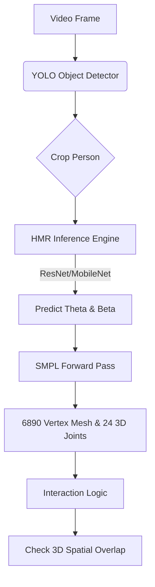

# 3D Human Mesh Recovery (HMR) Research

> **Objective:** Understand 3D Human Mesh Recovery (HMR) systems and architect a zero-code-change implementation plan for integrating them into the `BAS-Monitor` pipeline.

## 1. What is 3D HMR?

3D Human Mesh Recovery (HMR) is the process of estimating a full 3D human body surface (a dense mesh) and underlying skeleton from standard 2D images or video. 

Unlike standard pose estimators (like MediaPipe or YOLO-Pose) which only output 17-33 sparse skeletal keypoints, 3D HMR reconstructs the physical volume, shape, and biomechanical posture of the person.

### The SMPL Model
Almost all modern HMR systems rely on **SMPL** (Skinned Multi-Person Linear model) or its upgraded variant **SMPL-X** (which includes articulated hands and expressive faces).
- **Inputs:** 
  - **Pose ($\theta$):** 72 parameters representing the 3D rotation of 24 body joints.
  - **Shape ($\beta$):** 10 parameters representing body proportions (height, weight, proportions).
- **Outputs:** A dense 3D mesh consisting of **6,890 vertices** representing the human skin surface.

> [!NOTE] 
> By predicting just 82 parameters ($\theta$ and $\beta$), an AI model can perfectly reconstruct a 6,890-vertex 3D mesh of a person.

---

## 2. State-of-the-Art (SOTA) HMR Architectures

If we are to implement this in `BAS-Monitor`, we must select an architecture that balances accuracy with the computational constraints of an edge AI system (e.g., the Hailo-8L NPU).

| Model | Architecture | Pros | Cons | Edge Feasibility |
| :--- | :--- | :--- | :--- | :--- |
| **4DHumans (HMR 2.0)** | ViT (Vision Transformer) | Current SOTA. Unprecedented accuracy and temporal smoothness in wild videos. | Computationally heavy. Transformer layers are hard to compile for some edge NPUs. | Low (Requires cloud or high-end GPU) |
| **CLIFF** | ResNet-50 | Excellent at handling cropped bounding boxes and global 3D translation. | Older architecture. | Medium (ResNet is easily accelerated via ONNX/Hailo) |
| **MobileHMR** | MobileNetV3 | Designed explicitly for mobile/edge devices. | Lower accuracy on severe occlusions. | **High (Perfect for Hailo-8L / CPU)** |
| **MediaPipe Holistic** | Custom CNN | Extremely fast, runs anywhere. | Not a true SMPL mesh; outputs pseudo-3D landmarks. | Already integrated partially; lacks volumetric data. |

---

## 3. Why Add 3D HMR to BAS-Monitor?

Currently, `BAS-Monitor` relies on 2D/3D skeletal keypoints for `interaction_logic.py`. Moving to a full 3D HMR system unlocks advanced capabilities:

1. **True Depth and Volume:** Instead of guessing if a hand overlaps a bounding box in 2D (IoU), HMR allows for precise **3D Ray-Mesh intersection**. We can know exactly if a hand volume intersects a machine volume.
2. **Biomechanical Analysis:** SMPL provides exact joint angles (e.g., elbow flexion in degrees). This is critical for ergonomics, safety monitoring, and precise behavioral experiments.
3. **Occlusion Immunity:** HMR models are highly regularized by the SMPL kinematic tree. If a person's lower body is hidden behind a desk, the mesh naturally infers the posture, preventing the skeleton from "collapsing" like standard 2D pose estimators do.

---

## 4. Proposed Implementation Architecture

How HMR would fit into our existing `backend/ai/inference_pipeline.py` architecture without disrupting the flow.

### New Module Setup (`backend/ai/hmr_detector.py`)
To integrate this, we would build a new class conforming to the existing AI plugin architecture:

1. **Hardware Acceleration:** Convert a lightweight HMR model (like MobileHMR or CLIFF-ResNet50) to `ONNX`.
2. **Hailo Compilation:** Compile the ONNX model into a `.hef` file so it runs at zero-copy 30+ FPS alongside YOLO.
3. **Pipeline Swap:** Update `inference_pipeline.py` to optionally bypass `pose_detector.py` (MediaPipe) and use `hmr_detector.py` when rich volumetric data is needed.

---

## 5. Implementation Roadmap (Phased Approach)

If we proceed with this upgrade, here is the execution plan (requires no changes today):

> [!TIP] Implementation Phases
> **Phase 1: Prototyping (CPU/ONNX)**
> - Download pre-trained MobileHMR or CLIFF ONNX weights.
> - Create `backend/ai/hmr_detector.py` handling the image cropping, inference, and SMPL parameter extraction.
> 
> **Phase 2: Mesh Generation**
> - Implement a lightweight NumPy/PyTorch-lite SMPL forward pass to convert the 82 parameters into the 6,890 vertex locations.
>
> **Phase 3: Hardware Acceleration**
> - Run the HMR ONNX model through the Hailo Dataflow Compiler to generate a `.hef` file for the NPU.
> - Wire it into the `hailo_inference.py` engine.
>
> **Phase 4: 3D Interaction Logic**
> - Upgrade `interaction_logic.py` to calculate distances between object bounding boxes and the physical 3D mesh vertices, replacing 2D heuristics.
