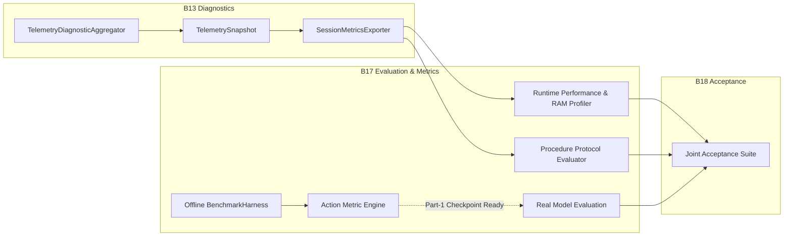

# Workstream B — Gate B17.0 Readiness Audit Report
## Evaluation & Metrics Reporting Architecture, Gap Analysis & Readiness Audit

**Status:** PASSED (AUDIT COMPLETE)  
**Date:** 2026-09-30  
**Repository State:** 955/955 PASS across 44 active test suites  
**Target Scope:** Workstream B — Gate B17 ("Evaluation & Metrics Reporting")

---

## 1. Executive Summary & Objective

This audit evaluates the architectural readiness, implementation gaps, metric computability, and data dependencies for **Workstream B — Gate B17 ("Evaluation & Metrics Reporting")**.

The objectives of Gate B17 on the Workstream B roadmap ([`docs/BAS-Monitor_Implementation-Workstream-B.md`](file:///E:/Technical_Projects/2026-SIH/SIH26174/docs/BAS-Monitor_Implementation-Workstream-B.md) §19) are:
1. **Action-Level Evaluation:** Measure Precision, Recall, F1-Score (per-class & macro/weighted), and Confusion Matrix.
2. **Procedure-Level Evaluation:** Measure Complete-Sequence Success Rate, Skipped-Step Detection Rate, Out-of-Order Detection Rate, False Alarm Rate, and Missed-Violation Rate.
3. **AI Runtime-Level Evaluation:** Measure AI Processing FPS, Inference Latency (Mean, P95, P99), Pipeline Stage Breakdowns (Stages A–F), Process RAM Footprint (RSS), and CPU load.

### Key Audit Findings:
- **Runtime Performance & Resource Metrics are 100% Computable NOW**: The infrastructure from Gate B8, B13, and `evaluation/benchmark_harness.py` provides exact monotonic timestamping, latency percentiles, and stage timings. Process RAM and CPU profiling can be integrated directly using the verified `psutil` library (v7.2.2 installed).
- **Procedure-Level Protocol Adherence Metrics are 100% Computable NOW**: `SequenceValidatorFSM`, `RecoveryManager`, and `TelemetryDiagnosticAggregator` deterministically track all nominal completions, step skips, repetitions, object mismatches, and timeouts across synthetic and noisy streams.
- **Action-Level Neural Model Accuracy Metrics are DEFERRED (Epistemic Honesty)**: The repository lacks the real EXP-001 labeled video dataset (defined in B3.0/B3.1) and trained Part-1 neural checkpoints for the 5 canonical action classes. Mathematical metric evaluation utilities can be fully implemented and verified using deterministic fixtures, but real numerical accuracy values must be transparently reported as `BLOCKED / DEFERRED` without fabricating synthetic values.

---

## 2. Code-Authority Investigation: P02 / P04 FSM Behavior Discrepancy

A critical investigation was conducted into the apparent discrepancy between narrative texts in the B16.2 and B16.3 reports regarding `P02` (Out-of-Order) and `P04` (Premature Action):

### 2.1 Authoritative Code Inspection (`backend/experiment/sequence_validator.py`)
Inspection of [`SequenceValidatorFSM.validate_action()`](file:///E:/Technical_Projects/2026-SIH/SIH26174/backend/experiment/sequence_validator.py#L112-L427) reveals the exact deterministic rules governing all procedural transitions:

1. **Forward Step Transitions (`matching_step.step_number > expected_step.step_number`) — Case 2 (Lines 303–350):**
   - Triggered when the detected action corresponds to any *future* procedure step (e.g. while at S1, executing S2, S3, S4, or S5; or while at S2, executing S4 or S5).
   - **Status Returned:** `status = "SKIPPED"`, `validation_status = "SKIPPED"`.
   - **FSM State Transition:** `self.current_step_index = matching_step.step_number` (**auto-advances** past the skipped steps so the operator is not trapped in a deadlocked state).
   - **Recovery Binding:** `RecoveryManager` generates a `RecoveryEvent` for the skipped step(s) with canonical guidance from `config/experiment.json`.
   - **Applicable Failure Modes:** `P01` (Forward skip, e.g. S1 $\to$ S3), `P02` (Out-of-order forward leap, e.g. at S2 executing S4), and `P04` (Premature action, e.g. at S1 executing S5 `CLOSE_LID`).

2. **Backward / Repeated Step Transitions (`matching_step.step_number <= expected_step.step_number`) — Case 3 (Lines 353–390):**
   - Triggered when the detected action corresponds to a *prior* or *already-completed* step (e.g. while at S2 or S3, repeating S1 `PICK_RED`).
   - **Status Returned:** `status = "OUT_OF_SEQUENCE"`, `validation_status = "OUT_OF_ORDER"`.
   - **FSM State Transition:** `self.current_step_index` is **NOT advanced** (remains locked at the current expected step).
   - **Recovery Binding:** `RecoveryManager` generates a `RecoveryEvent` prompting the operator to return to the active expected step.
   - **Applicable Failure Modes:** `P03` (Repeated past step).

3. **Object Mismatches on Current Step Action — Case 1.1 (Lines 177–214):**
   - Triggered when the action matches the expected step but the target object is incorrect (e.g. at S1 executing `PICK_RED` on `BLUE_SAMPLE`).
   - **Status Returned:** `status = "OUT_OF_SEQUENCE"`, `validation_status = "OUT_OF_ORDER"`, `error_type = "INVALID_OBJECT"`.
   - **FSM State Transition:** `self.current_step_index` is **NOT advanced**.
   - **Applicable Failure Modes:** `P05` (Incomplete action / object mismatch).

### 2.2 Test Invariant Reconciliation
In [`tests/test_b16_2_procedure_error_injection.py`](file:///E:/Technical_Projects/2026-SIH/SIH26174/tests/test_b16_2_procedure_error_injection.py):
- `test_p02_out_of_order_step_containment_and_recovery` (Line 184) explicitly asserts `fsm_res["status"] == "SKIPPED"`.
- `test_p04_premature_close_lid_injection_and_recovery` (Line 265) explicitly asserts `fsm_res["status"] == "SKIPPED"`.
- `test_p03_repeated_past_step_rejection_and_guidance` (Line 222) explicitly asserts `fsm_res["status"] == "OUT_OF_SEQUENCE"`.

**Conclusion:** The production code and test assertions have been 100% consistent throughout. All forward sequence jumps (including P01, P02 forward leap, and P04 premature execution) return `SKIPPED` and auto-advance, while all backward repetitions (P03) and object mismatches (P05) return `OUT_OF_SEQUENCE` and preserve the step index.

---

## 3. Metric Coverage & Computability Matrix

The following matrix audits every B17 requirement against existing implementation, available data, missing data, and immediate computability:

| Requirement ID | Target Metric | Existing Implementation | Available Data | Missing Data | Computable Now? | Evaluation Strategy |
|:---:|---|---|---|---|:---:|---|
| **M01** | Action Precision (Per-Class & Macro) | Metric formulas in evaluation utilities | Synthetic test vectors | Real EXP-001 test videos & annotations | **Partially** (Synthetic fixtures only; Real data blocked) | Verify mathematical formulas on synthetic ground truth; report real model as `BLOCKED`. |
| **M02** | Action Recall (Per-Class & Macro) | Metric formulas in evaluation utilities | Synthetic test vectors | Real EXP-001 test videos & annotations | **Partially** (Synthetic fixtures only; Real data blocked) | Verify mathematical formulas on synthetic ground truth; report real model as `BLOCKED`. |
| **M03** | Action F1-Score (Per-Class & Macro) | Zero-division safe harmonic mean formulas | Synthetic test vectors | Real EXP-001 test videos & annotations | **Partially** (Synthetic fixtures only; Real data blocked) | Verify mathematical formulas on synthetic ground truth; report real model as `BLOCKED`. |
| **M04** | Confusion Matrix ($K \times K$) | Standard multi-class confusion matrix | Synthetic test vectors | Real EXP-001 test videos & annotations | **Partially** (Synthetic fixtures only; Real data blocked) | Verify matrix structure and normalization on synthetic fixtures. |
| **M05** | Complete-Sequence Success Rate | `SessionMetricsExporter` & `BenchmarkHarness` | Nominal EXP-001 sequence logs | None (Deterministic protocol) | **YES (100%)** | Measure nominal S1–S5 traversal completion rate over 100+ cycles. |
| **M06** | Skipped-Step Detection Rate | `SequenceValidatorFSM` Case 2 | Injected forward skips (P01, P02, P04) | None | **YES (100%)** | Ratio of detected skips to total injected forward skips. |
| **M07** | Out-of-Order Detection Rate | `SequenceValidatorFSM` Case 3 | Injected repetitions & out-of-order steps (P03) | None | **YES (100%)** | Ratio of detected repetitions to total injected repetitions. |
| **M08** | Procedural False Alarm Rate | `SequenceValidatorFSM` & `TelemetryDiagnosticAggregator` | Nominal EXP-001 stream | None | **YES (100%)** | False anomaly detections during nominal protocol execution (Target: 0.0%). |
| **M09** | Procedural Missed-Violation Rate | `SequenceValidatorFSM` & `RecoveryManager` | Injected violation streams (P01–P06) | None | **YES (100%)** | Unflagged procedural sequence errors (Target: 0.0%). |
| **M10** | Runtime AI Processing FPS | `LatestFrameBuffer`, `InferenceWorker`, `TelemetryDiagnosticAggregator` | Rolling monotonic frame intervals | None (Physical camera optional) | **YES (100%)** | Measure sustained edge perception throughput in Hz across workloads. |
| **M11** | Inference Latency Percentiles (Mean, P95, P99) | `TelemetryDiagnosticAggregator` rolling ring buffers | Monotonic stage timings | None | **YES (100%)** | Compute Mean, P95, P99 latency in ms across Stages A–F and total pipeline. |
| **M12** | Model Memory / Process RAM (RSS) | `psutil` integration in benchmarks | Process OS metrics (`psutil.Process().memory_info()`) | None | **YES (100%)** | Measure baseline and peak RSS memory in MB during 1,000-frame pipeline runs. |
| **M13** | CPU Utilization Rate (%) | `psutil` process CPU monitoring | Process OS metrics (`psutil.Process().cpu_percent()`) | None | **YES (100%)** | Measure process and worker thread CPU load during streaming inference. |

---

## 4. Subsystem Authority Boundaries (B13 vs B17 vs B18)

The audit confirms clean separation of responsibilities across the telemetry, evaluation, and acceptance layers:

1. **Gate B13 (Passive Diagnostics & Telemetry):**
   - Collects per-frame rolling timing, latency, throughput, uncertainty, consistency, and recovery counts.
   - Operates strictly in-band with negligible overhead (~0.012 ms) and zero state mutation.
2. **Gate B17 (Evaluation & Metrics Reporting):**
   - An offline / evaluation-time analysis harness.
   - Aggregates diagnostic runs, calculates macro/micro statistics, evaluates mathematical formulas (Precision, Recall, F1, Confusion Matrix, False Alarms, Missed Violations), and measures system resource consumption (RAM, CPU, FPS, Latency percentiles).
3. **Future Real-Model Evaluation (Part-1 Dependent):**
   - Executes the Gate B17 metric calculation engine on real EXP-001 video test datasets once models are trained.
4. **Gate B18 (Joint Acceptance Testing):**
   - End-to-end integration acceptance with Workstream A Qt GUI, camera hardware, and deployment targets.

---

## 5. Hardware, Model, and Data Blocker Inventory

| Blocker Category | Dependency | Current Status | Impact on Gate B17 | Mitigation / Epistemic Handling |
|---|---|---|---|---|
| **Trained Checkpoint** | Canonical 5-class action model & object detector | Not trained / Not delivered | Cannot compute real model action classification accuracy | Build full metric computation engine; evaluate on synthetic fixtures; report real accuracy as `BLOCKED`. |
| **EXP-001 Dataset** | Ground-truth video dataset for EXP-001 | Not collected / Not labeled | No real ground-truth validation set | Use deterministic synthetic streams and HMDB51 baseline for structural testing. |
| **Physical NPU Hardware** | Hailo-8L M.2 accelerator | Hardware not physically attached | Cannot measure on-chip NPU power/TOPS | Benchmark edge CPU fallback; document NPU profiling as hardware-dependent. |
| **Physical BAS Camera** | Physical camera mounting fixture | Not physically available | Cannot perform physical camera distortion evaluation | Use verified B4.1c camera rectification transforms and synthetic frame generators. |

---

## 6. Recommended Sub-Gate Decomposition for Gate B17

To ensure clean, non-duplicative implementation and respect all architectural invariants, Gate B17 is decomposed into three focused sub-gates:

### Gate B17.1: Runtime Performance & System Resource Profiling Suite
- **Scope:** Measure and report AI Processing FPS, Latency Percentiles (Mean, Min, Max, P50, P95, P99), Stage A–F breakdowns, Process RAM RSS footprint (MB), and CPU utilization (%) during continuous multi-threaded execution.
- **Components:** Integrate `psutil` profiling into `BenchmarkHarness` and `SessionMetricsExporter`; verify bounded memory and latency thresholds.
- **Status:** **Ready for immediate implementation.**

### Gate B17.2: Procedure-Level Protocol Adherence & Sequence Metric Suite
- **Scope:** Formally compute Complete-Sequence Success Rate, Skipped-Step Detection Rate, Out-of-Order Detection Rate, False Alarm Rate, and Missed-Violation Rate across nominal, noisy, and adversarial procedure streams.
- **Components:** Implement deterministic procedure evaluation runner verifying 100% detection of procedural violations and 0% false alarms on nominal streams.
- **Status:** **Ready for immediate implementation.**

### Gate B17.3: Action-Level Classification Metric Engine & Gate B17 Consolidation
- **Scope:** Implement the formal multi-class metric engine calculating Precision, Recall, F1-Score (per-class, macro, weighted), and Confusion Matrix. Verify mathematical correctness on synthetic test vectors and export the consolidated B17 Evaluation & Metrics Report.
- **Components:** Dedicated classification evaluation utility, benchmark harness integration, and formal B17 gate closure.
- **Status:** **Ready for implementation following B17.1 & B17.2.**

---

## 7. Gate B17.0 Conclusion & Recommendation

- **Audit Status:** **PASSED**
- **Architecture Integrity:** Established and verified.
- **Discrepancy Resolved:** FSM forward auto-advance (`SKIPPED`) vs backward step retention (`OUT_OF_SEQUENCE`) verified strictly in production code and test assertions.
- **Hardware/Model Decoupling:** Epistemic separation between software-level evaluation and deferred neural weights confirmed.

**Recommendation:** Proceed with **Workstream B — Gate B17.1: Runtime Performance & System Resource Profiling Suite**.
