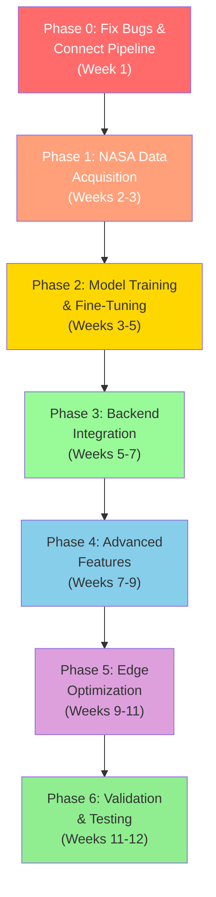

# BAS-Monitor — AI Model Implementation Plan

## Document References
- [notebook-analysis.md](file:///Users/prathmesh/Documents/GitHub/BAS-Monitor/docs/notebook-analysis.md) — Current AI pipeline analysis
- [BAS-Monitor_Implementation-Workstream-A.md](file:///Users/prathmesh/Documents/GitHub/BAS-Monitor/docs/BAS-Monitor_Implementation-Workstream-A.md) — System/runtime implementation plan

---

## 1. Current State Assessment

### What Exists (Notebooks — Part 1)
The current pipeline uses **HMDB51** (a general-purpose action recognition dataset) to build a **binary classifier** (`catch` vs `not_catch`). This is a proof-of-concept, not a production-ready BAS experiment monitor.

| Component | Model | Training Data | Status |
|-----------|-------|---------------|--------|
| Action Classifier | R(2+1)D-18 | HMDB51 (6 classes → binary) | Code done, **unexecuted** |
| Object Detector | YOLOv8n (pretrained) | COCO 80 classes | Diagnostic only, no fine-tuning |
| Pose Estimator | YOLOv8n-Pose (pretrained) | COCO keypoints | Diagnostic only |
| Hand Detector | MediaPipe Hands / YOLOv8-Pose wrist | — | Wrist-only, no fine-grained hand |

### What Exists (Backend — Part 2)
| Module | State | Critical Gap |
|--------|-------|-------------|
| [inference_pipeline.py](file:///Users/prathmesh/Documents/GitHub/BAS-Monitor/backend/ai/inference_pipeline.py) | Full orchestrator, runs all detectors | **Never called from Bridge/camera loop** |
| [object_detector.py](file:///Users/prathmesh/Documents/GitHub/BAS-Monitor/backend/ai/object_detector.py) | YOLOv8 wrapper | No weights on disk → falls back to **hardcoded mock** detections |
| [action_classifier.py](file:///Users/prathmesh/Documents/GitHub/BAS-Monitor/backend/ai/action_classifier.py) | TFLite temporal classifier | No `.tflite` weights → falls back to **heuristic mapping** |
| [sequence_validator.py](file:///Users/prathmesh/Documents/GitHub/BAS-Monitor/backend/experiment/sequence_validator.py) | Full FSM with voice/logging | **Completely disconnected** from InferencePipeline |
| [hailo_inference.py](file:///Users/prathmesh/Documents/GitHub/BAS-Monitor/backend/ai/hailo_inference.py) | Init code only | Output tensor parsing **unimplemented** (`return [], []`) |

> [!CAUTION]
> **The biggest gap is not the AI model itself — it's that the AI pipeline is completely disconnected from the live camera feed.** `bridge.py` captures frames for display/recording/streaming but **never sends them to InferencePipeline or SequenceValidatorFSM**.

---

## 2. NASA Dataset Strategy

There is no single "NASA BAS experiment video dataset" available for download. Instead, we propose a **multi-source data acquisition strategy**:

### 2.1 Primary Sources

#### Source A: NASA Image and Video Library (Public Domain)
- **API**: `https://images-api.nasa.gov/search` (no API key required)
- **Content**: ISS experiment footage, Life Science Glovebox operations, astronaut lab work
- **Search keywords**: `"Life Science Glovebox"`, `"protein crystallization ISS"`, `"ISS biology experiment"`, `"astronaut science experiment"`, `"microgravity experiment"`
- **Use case**: Extract frames for object detection annotation (lab equipment in microgravity)
- **License**: Public domain (NASA media)

```python
# Example: Bulk download NASA ISS experiment videos
import requests

queries = [
    "ISS science experiment",
    "Life Science Glovebox",
    "astronaut biology experiment",
    "protein crystal growth ISS",
    "microgravity laboratory"
]

for q in queries:
    resp = requests.get(
        "https://images-api.nasa.gov/search",
        params={"q": q, "media_type": "video", "page_size": 100}
    )
    items = resp.json()["collection"]["items"]
    for item in items:
        nasa_id = item["data"][0]["nasa_id"]
        # Get download links
        asset_resp = requests.get(
            f"https://images-api.nasa.gov/asset/{nasa_id}"
        )
        # Download highest quality MP4...
```

#### Source B: NASA Open Science Data Repository (OSDR)
- **URL**: https://osdr.nasa.gov/
- **Content**: Bioimaging, environmental telemetry, experiment video data
- **Use case**: Domain-specific lab procedures, equipment close-ups

#### Source C: ISS National Lab & YouTube Archives
- **YouTube channels**: ReelNASA, Learn With NASA, ISS National Lab
- **Content**: STEMonstrations, experiment walkthroughs, equipment setup/teardown
- **Use case**: Action sequence labeling — astronauts performing step-by-step procedures

### 2.2 Supplementary Datasets

| Dataset | Use Case | Why |
|---------|----------|-----|
| **HMDB51** (current) | Pre-training temporal backbone | General action recognition baseline |
| **EPIC-KITCHENS** | Fine-grained hand-object interaction pre-training | Egocentric procedural actions with detailed annotations |
| **C3 Protein Crystallization** (Zenodo) | Crystal classification images | Domain-specific visual reference |
| **ActionSense** | Lab kitchen action segmentation | Detailed recordings of procedural steps |
| **Custom self-recorded dataset** | BAS experiment procedures | **Most critical** — record team performing experiment steps |

### 2.3 Recommended Data Collection Plan

> [!IMPORTANT]
> **The highest-impact data source is self-recorded video of your team performing BAS experiment procedures.** NASA footage supplements this but cannot replace it.

```text
DATA PIPELINE:
                                                    
NASA Video API ──────┐                             
NASA OSDR ───────────┤                             
YouTube Archives ────┤──→ Frame Extraction ──→ Annotation ──→ Training
Self-Recorded ───────┤       ↓                                  
EPIC-KITCHENS ───────┘   Quality Filter                        
                           ↓                                   
                      Preprocessing                            
                      (224×224, normalize)                      
```

**Target dataset composition:**

| Category | Source | Est. Videos | Purpose |
|----------|--------|-------------|---------|
| BAS experiment procedures | Self-recorded | 100–200 | Primary training data for action classifier |
| ISS lab operations | NASA API/OSDR | 200–500 | Object detection, environment adaptation |
| Procedural hand-object interactions | EPIC-KITCHENS subset | 500–1000 | Hand-object pre-training |
| General actions (negative class) | HMDB51 subset | 500+ | Negative/background class for classifier |

---

## 3. Implementation Roadmap

### Phase 0: Fix Critical Bugs & Connect the Pipeline (Week 1)

> [!CAUTION]
> **This must happen first.** Nothing else matters if the AI pipeline isn't wired to the camera.

#### 0.1 Connect InferencePipeline to Bridge camera loop
```text
bridge.py:getCameraFrame()
    ↓ frame
InferencePipeline.process_frame(frame)
    ↓ {action, confidence, objects, pose, hands}
SequenceValidatorFSM.validate_action(action, confidence, object)
    ↓ {status: VALID/SKIPPED/OUT_OF_ORDER, step, progress}
GUI + TTS + Logging
```

#### 0.2 Fix Notebook 06 bugs
- Fix column names: `action_df["action"]` → `action_df["action_catch_state"]`
- Fix column names: `yolo_df["detection_count"]` → `yolo_df["num_detections"]`
- Wire Cell 12 `sequence_decision()` into Cell 14
- Resolve `hands_detected = False` architecture decision

#### 0.3 Fix Notebook 03 `IN_COLAB` bug
- Add `IN_COLAB = "google.colab" in sys.modules`

#### 0.4 Align data contracts
- Create adapter between `InferencePipeline.process_frame()` output and `SequenceValidatorFSM.validate_action()` input

**Deliverable**: AI pipeline runs on live camera frames, actions flow through FSM to GUI/TTS.

---

### Phase 1: NASA Data Acquisition & Dataset Construction (Weeks 2–3)

#### 1.1 Build NASA video scraper
- Script to query NASA Image/Video Library API
- Download ISS experiment videos (filter by keywords, quality, duration)
- Store in `data/training/nasa_videos/`

#### 1.2 Frame extraction & quality filtering
- Reuse Notebook 02 preprocessing (Laplacian sharpness, brightness, contrast)
- Target: 640×640 frames for object detection, 224×224 clips for action recognition

#### 1.3 Self-record BAS experiment procedures
- Record team performing each defined experiment procedure step-by-step
- Multiple camera angles (fixed overhead, side view, POV)
- With and without gloves
- Multiple lighting conditions
- **Target**: 10+ complete run-throughs per procedure, 3+ camera angles

#### 1.4 Annotation
- **Object detection**: Label lab equipment in frames using CVAT/LabelImg
  - Classes: `pipette`, `crystallization_tray`, `centrifuge_tube`, `growth_chamber`, `reagent_bottle`, `petri_dish`, `sample_vial`, `analyzer_chamber`, `forceps`, `container_lid`
- **Action clips**: Trim videos into 2–5 second action segments, label with action class
- **Temporal annotation**: Mark start/end frames of each procedure step

**Deliverable**: Annotated dataset in `data/training/` with splits.

---

### Phase 2: Model Training & Fine-Tuning (Weeks 3–5)

#### 2.1 Object Detection — Fine-tune YOLOv8

```text
Current: yolov8n.pt (COCO 80 classes, generic)
Target:  yolov8n-bas.pt (10-15 BAS-specific classes)
```

| Parameter | Value |
|-----------|-------|
| Base model | `yolov8n.pt` (nano) or `yolov8s.pt` (small) |
| Dataset | NASA frames + self-recorded + COCO subset (person class) |
| Image size | 640×640 |
| Epochs | 100–200 |
| Batch size | 16 (adjust for GPU memory) |
| Augmentation | Mosaic, mixup, HSV jitter, random perspective |

#### 2.2 Action Classifier — Evolve from Binary to Multi-Class

```text
Current: R(2+1)D-18 → Binary (catch / not_catch)
Target:  R(2+1)D-18 → Multi-class BAS actions
```

**Proposed action classes (expand from current 2 to ~12):**

| Action | Description |
|--------|-------------|
| `PICK_UP_EQUIPMENT` | Hand reaches and grasps any lab tool |
| `PIPETTE_TRANSFER` | Using pipette to aspirate/dispense liquid |
| `INSERT_SAMPLE` | Placing sample into analyzer/chamber |
| `SEAL_CONTAINER` | Closing lid on container/vial |
| `MIX_SOLUTION` | Shaking, stirring, or vortexing |
| `INSPECT_SAMPLE` | Holding sample to camera/light for inspection |
| `RECORD_DATA` | Writing, using tablet, reading instruments |
| `PREPARE_WORKSPACE` | Setting up equipment before procedure |
| `DISPOSE_WASTE` | Placing used materials in waste container |
| `CLEAN_EQUIPMENT` | Wiping or sterilizing tools |
| `IDLE` | No active experiment action |
| `TRANSITION` | Moving between workstations |

**Training strategy:**
1. **Stage 1**: Freeze R(2+1)D-18 backbone, train new multi-class head on BAS clips (lr=1e-3, 15 epochs)
2. **Stage 2**: Unfreeze `layer4`, fine-tune end-to-end (lr=1e-5, 10 epochs)
3. **Stage 3**: Full fine-tune with all data (lr=1e-6, 5 epochs)

#### 2.3 Pose Model — Domain Validation

- Run YOLOv8-Pose on self-recorded footage
- Evaluate detection rate with lab gloves/suits
- If degraded: fine-tune or add MediaPipe Hands as supplementary

**Deliverable**: `yolov8n-bas.pt`, `action_model_bas.pt` checkpoint files.

---

### Phase 3: Backend Integration (Weeks 5–7)

#### 3.1 Replace fallbacks with real models

| Backend Module | Current State | Action |
|---|---|---|
| [object_detector.py](file:///Users/prathmesh/Documents/GitHub/BAS-Monitor/backend/ai/object_detector.py) | Mock fallback | Load `yolov8n-bas.pt`, update `KNOWN_CLASSES` |
| [action_classifier.py](file:///Users/prathmesh/Documents/GitHub/BAS-Monitor/backend/ai/action_classifier.py) | TFLite heuristic | Replace with PyTorch R(2+1)D-18 sliding window or export to TFLite |
| [pose_detector.py](file:///Users/prathmesh/Documents/GitHub/BAS-Monitor/backend/ai/pose_detector.py) | MediaPipe fallback | Keep MediaPipe or switch to YOLOv8-Pose |
| [hand_detector.py](file:///Users/prathmesh/Documents/GitHub/BAS-Monitor/backend/ai/hand_detector.py) | MediaPipe fallback | Keep MediaPipe Hands (21 landmarks) + evaluate glove performance |

#### 3.2 Connect InferencePipeline → SequenceValidatorFSM

Create the adapter function that bridges the perception output to the FSM:

```python
# In inference_pipeline.py or a new adapter module
def perception_to_fsm_event(pipeline_result: dict) -> dict:
    """Convert InferencePipeline output to SequenceValidatorFSM input."""
    return {
        "detected_action": pipeline_result["action"],
        "confidence": pipeline_result["confidence"],
        "object_name": pipeline_result.get("objects", [{}])[0].get("label"),
    }
```

#### 3.3 Wire into bridge.py camera loop

```python
# In bridge.py - inside the frame processing timer/loop
frame = self.camera.read()
if frame is not None:
    # 1. Run AI inference
    result = self.inference_pipeline.process_frame(frame)
    
    # 2. Run sequence validation
    if result["action"] != "IDLE":
        fsm_result = self.sequence_validator.validate_action(
            result["action"], result["confidence"], 
            result.get("primary_object")
        )
        
        # 3. Emit to GUI, TTS, Logger
        self.aiResultChanged.emit(json.dumps(fsm_result))
```

#### 3.4 Align action labels

| Backend ActionClassifier | Notebook 06 Pipeline | Workstream A Contract | **Unified** |
|---|---|---|---|
| `PICK_CONTAINER` | `catch` | `DetectedAction` | `PICK_UP_EQUIPMENT` |
| `PIPETTE_TRANSFER` | — | `DetectedAction` | `PIPETTE_TRANSFER` |
| `INSERT_ANALYZER` | — | `DetectedAction` | `INSERT_SAMPLE` |
| `IDLE` | `not_catch` | — | `IDLE` |

**Deliverable**: Fully connected AI inference → FSM → GUI/TTS pipeline with real model weights.

---

### Phase 4: Advanced Features & Improvements (Weeks 7–9)

#### 4.1 Temporal Smoothing & Multi-Frame Confirmation
- Port Notebook 06's EMA smoothing (α=0.35) into `ActionClassifier`
- Add dual-threshold hysteresis (on=0.50, off=0.30) to prevent flickering
- Require minimum 2 consecutive windows confirming same action before emitting

#### 4.2 Implement Proper Hand-Object Interaction
- Upgrade [interaction_logic.py](file:///Users/prathmesh/Documents/GitHub/BAS-Monitor/backend/experiment/interaction_logic.py):
  - Use hand landmarks (not just bounding boxes) for grasp detection
  - Add `OPERATING` and `RELEASING` states (currently missing)
  - Add temporal trajectory tracking (velocity-based approach/release detection)

#### 4.3 Object Tracking Across Frames
- Integrate ByteTrack or BoT-SORT for persistent object identity
- Track which specific tool the astronaut is interacting with across time
- Enable more reliable hand-object association

#### 4.4 Multi-Person Disambiguation
- Current: `keypoints[0]` (first detected person)
- Implement: ROI-based primary operator selection (person closest to workstation center)
- Log secondary persons as observers

#### 4.5 Dual-Mode Live Preview (Workstream A Phase A15)
- Clean View: Raw camera feed
- AI Evidence View: Bounding boxes, pose skeleton, hand landmarks, action label, confidence bar, step progress, FPS overlay

**Deliverable**: Production-quality perception pipeline with temporal reasoning.

---

### Phase 5: Model Optimization for Edge (Weeks 9–11)

#### 5.1 Model Export Pipeline

```text
PyTorch (.pt) → ONNX (.onnx) → Quantized INT8 → Target Format

Target formats:
├── TFLite       (Raspberry Pi CPU)
├── ONNX Runtime (x86/ARM CPU)
├── TensorRT     (NVIDIA Jetson)
└── Hailo HEF    (Hailo-8L NPU)
```

#### 5.2 Complete hailo_inference.py
- Implement the output tensor parser (currently returns `[], []`)
- Wire HailoInferenceEngine into InferencePipeline when NPU is available
- Benchmark: target ≥15 FPS on Hailo-8L

#### 5.3 Inference Scheduling
- Run object detection every frame
- Run pose estimation every 2nd–3rd frame (interpolate between)
- Run action classifier every 4th frame (sliding window stride)
- Total target: ≥12 FPS end-to-end on edge hardware

**Deliverable**: Optimized models running on target edge hardware.

---

### Phase 6: Validation & End-to-End Testing (Weeks 11–12)

#### 6.1 Execute Notebook 05 on GPU
- Run the R(2+1)D-18 training with real data
- Evaluate: target Catch F1 ≥ 0.80 (up from 0.64)

#### 6.2 Run Notebook 06 mini-eval
- Set `RUN_MINI_EVAL = True`
- Evaluate across full test split

#### 6.3 End-to-end BAS experiment test
- Load a real experiment procedure
- Run full pipeline: camera → detection → classification → FSM → GUI + TTS
- Verify all Workstream A acceptance criteria from Section 21

#### 6.4 Workstream B → A interface verification
Verify the contract produces all required fields:

```python
{
    "DetectedAction": str,        # e.g., "PIPETTE_TRANSFER"
    "Confidence": float,          # 0.0–1.0
    "ObjectEvidence": list,       # detected lab equipment
    "InteractionEvidence": dict,  # hand-object state
    "Timestamp": str,             # ISO 8601
    "ModelStatus": dict           # per-model load state
}
```

**Deliverable**: Validated end-to-end system matching Workstream A/B contracts.

---

## 4. Suggestions: Model Improvements & Additional Features

### 🔬 Architecture Upgrades

| Suggestion | Current | Proposed | Impact |
|------------|---------|----------|--------|
| **Video backbone** | R(2+1)D-18 (2018) | **Video Swin Transformer** or **TimeSformer** | Better long-range temporal modeling, SOTA action recognition |
| **Object detector** | YOLOv8n (3.2M params) | **YOLOv8s** (11.2M params) or **YOLOv10** | Better accuracy for small lab objects |
| **Hand model** | MediaPipe Hands (bare hands) | **HaMeR** or **Hand4Whole** | Works with gloves, 3D hand mesh recovery |
| **Action head** | Single binary classifier | **Multi-label + hierarchical** | Detect compound actions (e.g., "pipetting while inspecting") |

### 🧪 Novel Additions

1. **Anomaly Detection Module**
   - Train a one-class SVM or autoencoder on correct procedure execution
   - Flag unusual movements/pauses that deviate from expected patterns
   - Alert: "Unusual pause detected at Step 3" or "Unexpected hand movement"

2. **Procedure Completion Confidence Score**
   - Instead of binary VALID/INVALID, compute a continuous procedure quality score
   - Factor in: action confidence, execution time vs expected, smoothness of transitions
   - Output: "Procedure completed with 87% confidence score"

3. **Attention Heatmap Visualization**
   - Use Grad-CAM on the action classifier to show where the model is "looking"
   - Helps operators understand and trust the AI's decisions
   - Display as overlay in AI Evidence view

4. **Synthetic Data Generation**
   - Use NVIDIA Isaac Sim or Blender to generate synthetic lab environment renders
   - Programmatically vary: lighting, camera angle, equipment placement, hand poses
   - Massive dataset augmentation without real recording sessions
   - Particularly useful for rare error scenarios that are hard to record

5. **Few-Shot Action Adaptation**
   - When deploying a new experiment procedure, allow the system to learn from just 3–5 demonstration videos
   - Use metric learning (Prototypical Networks) to adapt to new action classes without full retraining
   - Critical for flexibility: new BAS experiments shouldn't require retraining the entire model

6. **Audio-Visual Fusion**
   - Many lab actions have distinctive sounds (clicking, bubbling, motor activation)
   - Add a lightweight audio classifier to complement visual detection
   - Especially useful for actions that are visually ambiguous but acoustically distinct

### 🎯 NASA Data-Specific Improvements

7. **Microgravity-Aware Pose Model**
   - Standard pose models assume gravity (feet on ground, upright orientation)
   - In microgravity, astronauts float in arbitrary orientations
   - Fine-tune pose model on NASA ISS footage with orientation augmentation (random rotations)

8. **Equipment State Tracking**
   - Beyond detecting objects, track their state: `lid_open`, `lid_closed`, `filled`, `empty`
   - Use object attribute classification head on detected bounding boxes
   - Enables validation like "container must be sealed before insertion"

9. **Procedure Timeline Visualization**
   - Record the temporal sequence of all detected actions as a Gantt-chart style timeline
   - Compare against expected timeline to identify delays, repetitions, omissions
   - Store as structured log for post-experiment review

---

## 5. High-Level Sequence



---

## 6. Risk Register

| Risk | Likelihood | Impact | Mitigation |
|------|-----------|--------|-----------|
| NASA footage insufficient for BAS-specific objects | High | High | Self-record experiment procedures; use synthetic data |
| R(2+1)D-18 catch F1 stays low (0.64) after fine-tuning | Medium | High | Try Video Swin / TimeSformer; unfreeze full backbone; increase data |
| MediaPipe Hands fails with gloves | High | Medium | Evaluate HaMeR; fall back to wrist-only from YOLOv8-Pose |
| Hailo NPU compilation fails for custom models | Medium | Medium | Keep CPU/GPU fallback path; use TFLite as intermediate |
| Insufficient self-recorded training data | Medium | High | Use synthetic data generation; apply heavy augmentation |
| Edge hardware can't meet 12 FPS target | Medium | High | Reduce model size (nano); skip frames; async inference |
