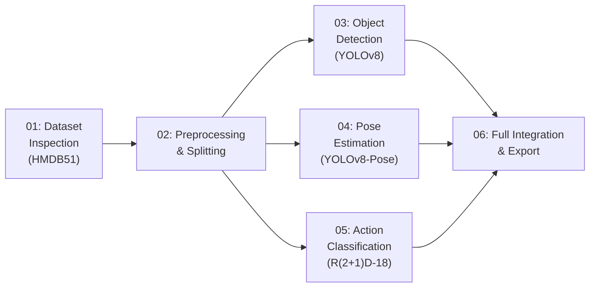

# BAS-Monitor AI Notebooks — Complete Analysis

## Overview

The 6 notebooks form a **sequential model development pipeline (Part 1)** for the BAS-Monitor system, using the **HMDB51 action recognition dataset** to build and validate an AI inference pipeline. The pipeline trains a binary temporal action classifier (`catch` vs `not_catch`) using R(2+1)D-18, supplemented by YOLOv8 object/person detection and YOLOv8-Pose estimation.



> [!IMPORTANT]
> All notebooks were developed in **Google Colab** with paths pointing to `/content/drive/MyDrive/SIH26174/training/`. Local execution requires path adaptation.

---

## Notebook-by-Notebook Analysis

### 📓 01 — Dataset Inspection (`01_dataset_inspection_CORRECTED (1).ipynb`)

| Aspect | Status |
|--------|--------|
| **Purpose** | Read-only inspection & structural audit of the raw HMDB51 dataset |
| **Code** | ✅ Complete — `VideoDatasetInspector` class, all cells executed |
| **Execution** | ✅ Fully executed in Colab with real data |

**What it does:**
- Scans the `hmdb51_sta` dataset: **51 action classes, 6,766 video clips** (all `.avi`)
- Verifies **100% readability** (6,766/6,766 videos decoded successfully)
- Profiles class distribution: min 101 (`catch`) → max 548 (`walk`) clips per class
- Generates deterministic `class_name ↔ class_id` mapping (0–50, lexicographic sort)
- Samples 2 videos/class for metadata profiling: 30 FPS uniform, resolutions 288×236 to 668×464, durations 1.07s–12.17s
- Identifies structural anomalies: `.tform.mat` files (HMDB51 stabilization matrices), `Thumbs.db` caches

**Outputs generated:**
- `training/configs/action_classes.json` — 51-class ID mapping
- `training/reports/dataset_summary.json` — comprehensive inspection report
- `training/reports/dataset_summary.md` — human-readable summary

**Action items:**
1. Downstream preprocessing must filter `.tform.mat` and `Thumbs.db` files
2. Frames need spatial standardization (variable resolutions → 224×224)
3. Temporal sub-sampling needed (video lengths vary 32–365 frames)

---

### 📓 02 — Preprocessing & Splitting (`02_preprocessing.ipynb`)

| Aspect | Status |
|--------|--------|
| **Purpose** | Deterministic stratified splitting + preprocessing config for HMDB51 |
| **Code** | ✅ Complete — all 17 cells executed successfully |
| **Execution** | ✅ Fully executed with real data |

**What it does:**
- Consumes Notebook 01 artifacts (`action_classes.json`, `dataset_summary.json`)
- Creates **deterministic video-level train/val/test splits** (70/15/15) using Largest Remainder Method (Hare-Niemeyer) with stratification per class
- **Strict data integrity**: 0 duplicates, 0 leakage between splits, all paths verified on disk
- Implements `sample_clip()`: 16-frame temporal sampling with uniform linspace, fallback sequential buffering for non-keyframe AVI containers
- Clip-consistent augmentation: random horizontal flip (p=0.5), brightness jitter (±5%)
- All frames resized to 224×224, normalized with ImageNet mean/std

**Split distribution:**

| Split | Videos | Percentage |
|-------|--------|------------|
| Train | 4,738 | 70.0% |
| Val | 1,023 | 15.1% |
| Test | 1,005 | 14.9% |
| **Total** | **6,766** | **100%** |

**Outputs generated:**
- `training/data/splits/train.csv`, `val.csv`, `test.csv`
- `training/configs/dataset_config.json`

**Key config:**
```json
{
  "clip_length": 16,
  "frame_sampling_strategy": "uniform_linspace_with_repetition",
  "image_size": 224,
  "tensor_layout": "[T, C, H, W]",
  "normalization": {"mean": [0.485, 0.456, 0.406], "std": [0.229, 0.224, 0.225]}
}
```

**Action items:**
1. Target actions for training are `['catch', 'clap', 'drink', 'eat', 'jump', 'throw']` — Notebook 05 must filter splits to these 6 classes
2. Paths are relative to `DATASET_ROOT`; local runs need path remapping

---

### 📓 03 — Object Detection Testing (`03_object_detection_testing_FIXED.ipynb`)

| Aspect | Status |
|--------|--------|
| **Purpose** | Evaluate pretrained YOLOv8 for person/object detection on HMDB51 frames |
| **Code** | ✅ Complete — diagnostic baseline, no training performed |
| **Execution** | ✅ Fully executed (CPU) |

**What it does:**
- Loads pretrained `yolov8n.pt` (6.2 MB, 80 COCO classes)
- **Diagnostic only** — evaluates COCO detection on HMDB51 frames, not BAS equipment
- Tests 7 action classes × 2 videos × 3 frames = **42 frames sampled**
- 88.1% detection rate (37/42 frames with ≥1 detection), 124 total bounding boxes
- `person` detected in 83.3% of frames (83 instances)
- Average confidence: 0.609

**Performance (CPU):**
- Average latency: 230.7 ms/frame (~4.3 FPS on CPU)
- Model load time: 0.55s

**Outputs generated:**
- `reports/yolo_object_detection_test.json`
- `reports/yolo_object_detection_test.md`
- `reports/yolo_object_detection_examples.png`

> [!WARNING]
> **Bug found:** `IN_COLAB` variable used in Cell 4 but never defined. Fresh kernel execution will raise `NameError`.

**Action items:**
1. Fix `IN_COLAB` check: add `IN_COLAB = "google.colab" in sys.modules`
2. For BAS deployment: fine-tune YOLOv8 on actual lab equipment (pipettes, trays, etc.)
3. Export to ONNX/TensorRT for real-time FPS (current CPU rate insufficient)

---

### 📓 04 — Pose Estimation Testing (`04_pose_hand_testing_YOLOV8_POSE (1).ipynb`)

| Aspect | Status |
|--------|--------|
| **Purpose** | Evaluate pretrained YOLOv8-Pose for body keypoint estimation on HMDB51 |
| **Code** | ✅ Complete — diagnostic baseline |
| **Execution** | ✅ Fully executed (T4 GPU) |

**What it does:**
- Loads pretrained `yolov8n-pose.pt` (6.5 MB, 17 COCO keypoints)
- Tests 9 action classes × 2 videos × 3 frames = **54 frames sampled**
- **98.1% pose detection rate** (53/54 frames), average 2.35 persons/frame
- Mean keypoint confidence: 0.5989
- Tracks upper-body joints specifically: wrists, elbows, shoulders
- **Explicit boundary**: YOLOv8-Pose provides wrist keypoints only, **NOT** 21-point hand landmarks. Hand detection rate reported as N/A.

**Performance (T4 GPU):**
- Average latency: 163.7 ms/frame (~6.1 FPS, unbatched with warmup)

**Outputs generated:**
- `reports/yolov8_pose_sampled_frames.csv`
- `reports/yolov8_pose_detection_results.csv`
- `reports/pose_detection_examples.png`
- `reports/yolov8_pose_test.json` & `.md`

**Action items:**
1. **Dedicated hand model decision**: YOLOv8-Pose only gives wrists. For fine-grained tool grasping (pipettes, vials), need MediaPipe Hands or YOLO-hand model
2. Multi-person disambiguation: currently takes first detected person (`keypoints[0]`)
3. Validate on lab footage with gloves/suits
4. Optimize inference for real-time (ONNX, TensorRT, batched, frame-skipping)

---

### 📓 05 — Action Classification Training (`Notebook_05_FINAL_CLEAN.ipynb`)

| Aspect | Status |
|--------|--------|
| **Purpose** | Train binary temporal action classifier (catch vs not_catch) using R(2+1)D-18 |
| **Code** | ✅ Complete — zero TODOs, fully implemented training pipeline |
| **Execution** | 🟡 Template (unexecuted — `execution_count: null`) — needs Colab GPU run |

**What it does:**
- **Model**: `torchvision.models.video.r2plus1d_18` pretrained, with frozen backbone
- **Classification head**: `nn.Sequential(Dropout(0.5), Linear(512, 2))`
- **Binary task**: `catch` (class 1) vs `not_catch` (class 0 = clap + drink + eat + jump + throw)
- **Training config**: 16-frame clips, 224×224, batch size 2, 15 epochs, AdamW (lr=1e-3, wd=1e-4), MultiStepLR (milestones 8, 12), AMP enabled, gradient clipping (max_norm=1.0)
- Class imbalance handled via inverse-frequency weighted CrossEntropyLoss
- Data integrity verified: zero leakage between splits, all file paths validated on disk
- Overfitting sanity check (25 steps on 4 samples/class) before full training
- Checkpoint saving: `best_checkpoint.pt` (by val catch F1) + `last_checkpoint.pt`
- Standalone inference API: `load_model_from_checkpoint()`, `preprocess_raw_frames()`, `predict_temporal_window()`

**Expected outputs (when executed):**
- `training/checkpoints/action_model/best_checkpoint.pt`
- `training/checkpoints/action_model/last_checkpoint.pt`
- `training/reports/action_validation_confusion_matrix.png`
- `training/reports/action_training_summary.json`
- `training/reports/action_training_history.json`

**Action items:**
1. **Execute on Colab GPU** with HMDB51 data and Drive mounted to produce actual weights
2. Consider 2-stage fine-tuning: unfreeze `layer4` with smaller lr if F1 is insufficient
3. For runtime: wrap `predict_temporal_window` with a FIFO buffer (length 16) + sliding stride (4–8 frames)

---

### 📓 06 — Full Integration & Export (`Notebook_06_INTEGRATED_FINAL (1).ipynb`)

| Aspect | Status |
|--------|--------|
| **Purpose** | End-to-end multi-modal pipeline integration, validation, and runtime packaging |
| **Code** | ⚠️ Complete but contains bugs (see below) |
| **Execution** | ✅ Fully executed (CPU) |

**What it does:**
- **Loads all 3 models**: R(2+1)D-18 (`best_checkpoint.pt`), YOLOv8m (`yolov8m.pt`), YOLOv8m-Pose (`yolov8m-pose.pt`)
- **Sliding window inference**: 16-frame windows, stride 4, batched (8 windows/batch)
- **Temporal smoothing**: EMA (α=0.35) on catch probabilities
- **Dual-threshold hysteresis**: on=0.50, off=0.30, min event duration=2 windows
- **Multi-modal state machine** combining action probabilities + object detections + pose keypoints → `VALID_CATCH_SEQUENCE_CANDIDATE` / `POSSIBLE_CATCH_NEEDS_REVIEW` / `INVALID_OR_NOT_DETECTED`
- **Exports runtime package**: `part2_runtime_package.zip` containing checkpoint, config, inference script, README

**Action model performance (from checkpoint):**

| Metric | Value |
|--------|-------|
| Val Accuracy | 92.11% |
| Catch Precision | 80.00% |
| Catch Recall | 53.33% |
| Catch F1 | 0.6400 |
| Best Epoch | 6 |

**Test video result:**
- Catch probabilities peaked at 0.73–0.80, 1 action event detected
- Person detection: 100%, pose detection: 100%, mean keypoint confidence: 0.79
- Runtime: ~89–174 seconds per video on CPU

> [!CAUTION]
> **4 critical bugs/gaps identified:**

1. **Wrong column names in Cell 14**: `action_df["action"]` should be `action_df["action_catch_state"]`; `yolo_df["detection_count"]` should be `yolo_df["num_detections"]`. Both evaluate to 0, causing the decision to incorrectly return `"UNCERTAIN"` despite valid detections.

2. **State machine bypassed**: Cell 12 defines a proper `sequence_decision()` function, but Cell 14 uses an ad-hoc ternary instead of calling it.

3. **Hand detection always false**: Config requires `MIN_HAND_DETECTION_RATE = 0.10`, but YOLOv8-Pose only provides wrist keypoints. `hands_detected` is hardcoded to `False`.

4. **Mini-evaluation skipped**: `RUN_MINI_EVAL = False` — only 1 test video evaluated.

**Outputs generated:**
- `reports/integrated_timeline.png` — 4-panel diagnostic visualization
- `reports/*_action_timeline.csv`, `*_action_events.csv`
- `reports/*_yolo_features.json`, `*_pose_features.csv`
- `reports/*_integrated_decision.json`
- `exports/part2_runtime_package.zip` (model + config + inference script + README)

---

## Summary: What's Done vs What Needs To Be Done

### ✅ Completed

| Component | Details |
|-----------|---------|
| HMDB51 dataset inspection | 51 classes, 6,766 videos, 100% readable |
| Deterministic train/val/test splits | 70/15/15, stratified, leak-free, 6,766 videos |
| Preprocessing pipeline | 16-frame clip sampling, 224×224, ImageNet normalization |
| YOLOv8 object detection baseline | 88.1% detection rate on HMDB51 samples |
| YOLOv8-Pose estimation baseline | 98.1% detection rate, 17 COCO keypoints |
| R(2+1)D-18 action classifier | Binary catch/not-catch, frozen backbone transfer learning |
| Integrated multi-modal pipeline | Sliding window + EMA + hysteresis + state machine |
| Runtime export package | `part2_runtime_package.zip` with inference script |

### ❌ Needs To Be Done

| Priority | Task | Details |
|----------|------|---------|
| 🔴 **Critical** | Fix bugs in Notebook 06 | Wrong column names, bypassed state machine, hardcoded `hands_detected=False` |
| 🔴 **Critical** | Execute Notebook 05 on GPU | Produce actual `best_checkpoint.pt` weights (currently unexecuted template) |
| 🔴 **Critical** | Run multi-video evaluation | `RUN_MINI_EVAL = True` across test split to get real precision/recall/F1 |
| 🟠 **High** | Resolve hand landmark architecture | Either add MediaPipe Hands alongside YOLOv8-Pose, or formally remove hand requirements from state machine |
| 🟠 **High** | Port to Part 2 backend | Extract `part2_runtime_package.zip` into BAS-Monitor `backend/ai/` modules |
| 🟠 **High** | Connect sliding-window inference to live camera | FIFO frame buffer → 16-frame window → R(2+1)D-18 → state machine → GUI/TTS |
| 🟠 **High** | Multi-person disambiguation | Currently takes `keypoints[0]`; need primary-actor selection strategy |
| 🟡 **Medium** | Fine-tune YOLOv8 on BAS lab equipment | Custom dataset of pipettes, trays, vials for domain-specific detection |
| 🟡 **Medium** | Backbone unfreezing (2-stage fine-tuning) | If Catch F1 (0.64) is insufficient, unfreeze `layer4` with smaller lr |
| 🟡 **Medium** | Model optimization for edge deployment | ONNX export, TensorRT/OpenVINO, FP16, Hailo NPU compilation |
| 🟡 **Medium** | Validate on real lab footage | Test with gloves, suits, specific camera angles for domain shift |
| 🟢 **Low** | Fix `IN_COLAB` bug in Notebook 03 | Add `IN_COLAB = "google.colab" in sys.modules` |
| 🟢 **Low** | Adapt Colab paths for local execution | Map `/content/drive/MyDrive/SIH26174/training/` → local paths |
