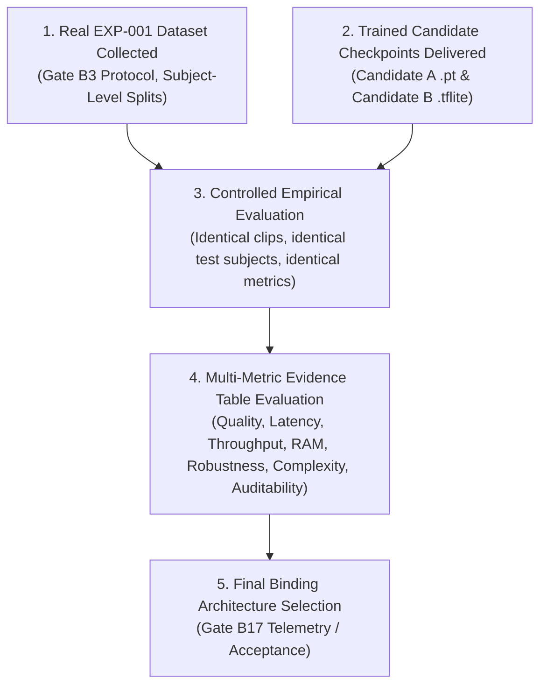

# Workstream B B5.4 — Model Architecture Decision Record

**Date:** 2026-09-24  
**Gate:** B5.4 — Architecture Decision (Sub-gate of B5: Model Architecture Evaluation)  
**Author:** Workstream B (AI / Procedure Intelligence)  
**Status:** PARTIALLY PASSED — ARCHITECTURAL DIRECTION ADOPTED FOR PART-2 / FINAL NEURAL MODEL SELECTION DEFERRED

---

## 1. Executive Status & Gate Outcome

| Governance Dimension | Decision Reality | Epistemic Status |
|---|---|:---:|
| **Part-2 Engineering Architecture Direction** | **ADOPTED: Candidate B (Decoupled Feature-Based Temporal Pipeline)** | **DECIDED (Engineering Direction)** |
| **Final Neural Network Model Selection** | **`NO — DEFERRED`** | **DEFERRED (Pending Checkpoints & Data)** |
| **Public AI Result Contract** | **`FROZEN`** ([`docs/architecture.md`](file:///E:/Technical_Projects/2026-SIH/SIH26174/docs/architecture.md) §2 strictly preserved) | **VERIFIED REALITY** |
| **Gate B5 Overall Status** | **`PARTIALLY_PASSED`** (B5.1, B5.2, B5.3, B5.4 executed; model accuracy comparison deferred) | **PARTIALLY PASSED** |

> [!IMPORTANT]
> **Core Decision Boundary:**
> 1. Because the **EXP-001 procedure dataset has not yet been collected** and **neither Candidate A (R(2+1)D-18) nor Candidate B (1D-TCN) trained checkpoint weights exist in the repository**, a final neural-model selection claiming empirical superiority (accuracy, precision, recall, F1) **CANNOT** be made at this gate. Fabricating an experimental winner would violate scientific and engineering integrity.
> 2. Based on empirical pipeline benchmarks ([B5.2](file:///E:/Technical_Projects/2026-SIH/SIH26174/docs/workstream-b-architecture-benchmark.md) / [B5.3](file:///E:/Technical_Projects/2026-SIH/SIH26174/docs/workstream-b-available-components-benchmark.md)) and edge system constraints (Raspberry Pi 5 CPU + Hailo-8L NPU), Workstream B adopts **Candidate B (Decoupled Feature-Based Temporal Architecture)** as the **architectural direction for Part-2 development**.
> 3. **Engineering Direction vs. Model Proof:** Adopting Candidate B is an *engineering architecture decision* for structuring Part-2 edge software interfaces, asynchronous queues, and FSM validation. It is **NOT** an empirical proof or claim that a future trained 1D-TCN model will outperform a trained R(2+1)D-18 model on task accuracy or macro-F1.
> 4. Neural-model empirical superiority is **NOT** established by this gate; final model acceptance will be decided under Gate B17 when trained artifacts and real procedure evaluation data become available.

---

## 2. Side-by-Side Evidence Table

The decision synthesizes verified empirical measurements, theoretical literature estimates, and blocked experimental metrics:

| Decision Dimension | Candidate A: R(2+1)D-18 (End-to-End) | Candidate B: 1D-TCN (Decoupled Feature Pipeline) | Epistemic Category |
|---|---|---|:---:|
| **Repository Implementation** | Absent (No video CNN module in `backend/`) | Present ([`FrameProcessor`](file:///E:/Technical_Projects/2026-SIH/SIH26174/backend/video/frame_processor.py#L305), [`ActionClassifier`](file:///E:/Technical_Projects/2026-SIH/SIH26174/backend/ai/action_classifier.py#L18)) | **VERIFIED REALITY** |
| **Input Tensor Representation** | 5D Video Tensor: `(1, 3, T, H, W)` | 3D Feature Tensor: `(1, 30, 111)` | **VERIFIED REALITY** |
| **Input Feature Extraction Latency** | N/A (Consumes raw video frames) | $\mathbf{0.043\text{ ms}}$ per frame ($>23,000\text{ FPS}$) | **VERIFIED MEASUREMENT** |
| **Temporal Buffer Stacking Latency** | N/A (Video buffer sliding) | $\mathbf{0.069\text{ ms}}$ per window ($>14,500\text{ WPS}$) | **VERIFIED MEASUREMENT** |
| **Combined Feature + Buffer Prep** | N/A | $\mathbf{0.112\text{ ms}}$ total ($>8,900\text{ WPS}$) | **VERIFIED MEASUREMENT** |
| **Full Preprocessing Pipeline Cost** | $98.3\text{ ms}$ ($16\times 112$) / $540.4\text{ ms}$ ($32\times 224$) | $4.67\text{ ms}$ (Detector) + $29.93\text{ ms}$ (Pose) + $0.11\text{ ms}$ (Vec) | **VERIFIED MEASUREMENT** |
| **Buffer / Tensor Memory Footprint** | $2.35\text{ MB}$ ($16\times 112$) / $18.82\text{ MB}$ ($32\times 224$) | $\mathbf{13.0\text{ KB}}$ (30-frame window buffer) | **VERIFIED MEASUREMENT** |
| **Theoretical Parameter Scale** | $\approx 31.5\text{M -- }33.0\text{M}$ parameters | $\approx 20\text{K -- }100\text{K}$ parameters | **THEORETICAL ESTIMATE** |
| **Theoretical Computational Scale** | $\approx 7.5\text{ -- }15.0\text{ GFLOPs}$ per clip | $\approx 1.0\text{ -- }5.0\text{ MFLOPs}$ per window | **THEORETICAL ESTIMATE** |
| **Edge Hardware Suitability** | Requires GPU/NPU 3D-CNN support; heavy on CPU | Optimal: Spatial NPU (Hailo-8L) + Host CPU TCN | **THEORETICAL ESTIMATE** |
| **Runtime Dependency Burden** | Heavy (`torch`, `torchvision`, `pytorchvideo`) | Lightweight (`tflite_runtime`, ONNX, pure NumPy) | **VERIFIED REALITY** |
| **Upstream Coupling & Failure Modes** | Self-contained (Direct pixel consumer) | Coupled to upstream object & pose detector accuracy | **THEORETICAL FACT** |
| **Explainability & Debugging** | Black-box spatio-temporal features | Modular: Geometric coordinate inspection vs temporal FSM | **THEORETICAL FACT** |
| **Model Checkpoint Status** | **`ABSENT`** (`models/r2plus1d_18.pt` not found) | **`ABSENT`** (`data/temporal_action.tflite` not found) | **VERIFIED REALITY** |
| **Model Inference Latency** | **`BLOCKED`** (No PyTorch runtime / no checkpoint) | **`BLOCKED`** (No TFLite runtime / no checkpoint) | **BLOCKED** |
| **Classification Accuracy / Macro-F1** | **`BLOCKED`** (No EXP-001 dataset / no checkpoint) | **`BLOCKED`** (No EXP-001 dataset / no checkpoint) | **BLOCKED** |

---

## 3. Detailed Rationale for Candidate B Architectural Direction

Workstream B adopts Candidate B as the primary engineering direction for Part-2 development based on four structural pillars:

### 3.1 Edge Resource & Latency Budget Feasibility
- On the target Raspberry Pi 5 platform (15 FPS operating budget $\to 66.6\text{ ms}$ total frame budget), Candidate B cleanly decouples compute:
  - **Spatial Perception Layer:** Offloaded to the Hailo-8L NPU (26 TOPS) executing YOLOv8 object detection and 3D pose/hand tracking in parallel hardware streams.
  - **Temporal Action Classification:** Evaluates lightweight vector convolutions on the host CPU in $<3\text{ ms}$ with $<15\text{ KB}$ RAM overhead, well within the host CPU budget.
- Conversely, Candidate A processes raw spatio-temporal video voxels directly on host CPU cores ($98\text{--}540\text{ ms}$ preprocessing in NumPy + heavy 3D convolution inference), creating severe risk of frame drops and thermal throttling without dedicated 3D-CNN NPU acceleration.

### 3.2 Modular Explainability & Spatial Invariant Normalization
- Spaceflight procedure validation requires auditability. Candidate B's intermediate representation (33 pose joints + 4 object centroids) allows deterministic inspection:
  - Engineers can inspect whether an error was caused by **spatial occlusion** (lost landmark) or **temporal anomaly** (out-of-order motion).
  - Spatial coordinates can be normalized using scale invariants and orientation-robust distance metrics ([`backend/experiment/interaction_logic.py`](file:///E:/Technical_Projects/2026-SIH/SIH26174/backend/experiment/interaction_logic.py)).

### 3.3 Active Codebase Alignment & Architectural Cohesion
- The existing Part-2 codebase was already structured around Candidate B:
  - [`FrameProcessor.extract_keypoint_vector()`](file:///E:/Technical_Projects/2026-SIH/SIH26174/backend/video/frame_processor.py#L305) produces the exact 111-dimensional vector.
  - [`ActionClassifier`](file:///E:/Technical_Projects/2026-SIH/SIH26174/backend/ai/action_classifier.py#L18) implements the 30-frame temporal sliding window queue.
  - [`InferencePipeline`](file:///E:/Technical_Projects/2026-SIH/SIH26174/backend/ai/inference_pipeline.py#L28) coordinates upstream detectors with the action classifier.

### 3.4 Explicit Caveat: Upstream Detector Dependency
- Candidate B's primary trade-off is **upstream error propagation**: if the object detector or pose tracker drops an object or landmark due to severe microgravity glare or occlusion, the 111-dimensional feature vector degrades. Gate B11 (Uncertainty Handling) and Gate B10 (Temporal Confirmation) will specifically address this vulnerability.

---

## 4. Final Model-Selection Gate & Acceptance Protocol

Final neural model selection will occur when real training and dataset collection gates are reached. The acceptance decision must satisfy the following mandatory protocol:



### 4.1 Multi-Metric Evidence Evaluation (Transparent Evidence Table, Not Arbitrary Weighted Score)

Final architecture selection must be determined from a **transparent, multi-metric evidence table** rather than an arbitrarily weighted composite score. The final selection evaluation must assess candidates across eight concrete dimensions:

1. **Classification Quality:** Unweighted macro-averaged F1 score, precision, recall, and confusion matrix across all 5 canonical EXP-001 procedure actions on the held-out subject test split.
2. **Inference Latency:** Per-frame / per-window inference latency percentiles (p50, p95, p99, and max latency).
3. **Throughput:** Processing throughput measured in frames per second (FPS) and sliding windows per second (WPS).
4. **Memory Footprint:** Peak resident set size (RAM), working buffer size, and model weight footprint on disk.
5. **Robustness:** Microgravity orientation invariant degradation ($\Delta F1 \le 15\%$ across all 7 canonical angles) and environmental disturbance tolerance across the 7 disturbance dimensions.
6. **Edge Feasibility:** Sustained deterministic execution within the $\le 66.6\text{ ms}$ per-frame budget ($15\text{ FPS}$) on target Raspberry Pi 5 hardware with acceptable thermal characteristics.
7. **Implementation & Integration Complexity:** Software dependency burden (`torch` vs lightweight runtimes), build complexity, and host pipeline maintainability.
8. **Reliability & Auditability:** Capability for deterministic intermediate state inspection (spatial coordinates vs temporal sequences), failure isolation, and transparent telemetry logging. Auditability is evaluated structurally through inspection capabilities, not via arbitrary subjective numerical scores.

> [!NOTE]
> **Non-Binding Illustrative Composite Score:**
> Any weighted formula (such as $\text{Score} = 0.35 \cdot F1 + 0.25 \cdot \text{Feasibility} + 0.20 \cdot \text{Robustness} + 0.20 \cdot \text{Auditability}$) represents an *illustrative conceptual heuristic only* and is **NON-BINDING**. Final project acceptance must evaluate the full multi-metric evidence table holistically against mission requirements.

---

## 5. Deferred Items Register

The following components remain deferred and explicitly documented with their unblocking prerequisites:

| Deferred Item | Current Status | Required Artifact to Unblock | Expected Gate |
|---|:---:|---|:---:|
| **EXP-001 Procedure Dataset** | `NOT COLLECTED` | Physical recording of 5 canonical actions across diverse subjects | Part 1 / Gate B3 Protocol |
| **Candidate A Checkpoint** | `ABSENT` | `models/r2plus1d_18.pt` trained on procedure actions | Part 1 Model Revision |
| **Candidate B Checkpoint** | `ABSENT` | `data/temporal_action.tflite` trained on 111-dim sequences | Part 1 Model Revision |
| **Procedure Action F1 / Accuracy** | `BLOCKED` | Real inference evaluation against held-out TEST split | Gate B17 |
| **Orientation F1 Degradation ($\Delta F1_\theta$)** | `BLOCKED` | Multi-angle test clips evaluated with trained model | Gate B17 |

---

## 6. Relationship to Gate B6 (Real Inference Pipeline)

Gate B5.4 provides clean architectural guidance for Gate B6:

1. **Decoupled Interface Boundary:** Gate B6 will implement the real multimodal inference graph (`InferencePipeline`) coordinating object detection, 3D body pose, hand tracking, geometric interaction evaluation, and temporal vector classification.
2. **Pluggable Classifier Interface:** The interface between spatial extraction and temporal action recognition will remain decoupled via [`ActionClassifier`](file:///E:/Technical_Projects/2026-SIH/SIH26174/backend/ai/action_classifier.py#L18) and [`ActionRecognizer`](file:///E:/Technical_Projects/2026-SIH/SIH26174/backend/ai/action_recognizer.py#L18). If Part-1 eventually provides an end-to-end video model or a revised 1D-TCN model, either can be integrated into `inference_pipeline.py` without modifying downstream consumers.
3. **Frozen Public AI Result Contract:** Gate B6 will strictly preserve the public AI result schema from [`docs/architecture.md`](file:///E:/Technical_Projects/2026-SIH/SIH26174/docs/architecture.md) §2:
   ```json
   {
     "timestamp": "2026-08-29T10:00:05",
     "action": "PICK_RED",
     "object": "RED_SAMPLE",
     "confidence": 0.94,
     "expected_step": "S1",
     "detected_step": "S1",
     "status": "VALID",
     "next_step": "S2"
   }
   ```
   *Downstream consumers (FSM sequence validator, GUI, voice alert worker, structured logger) remain completely decoupled from model internals.*
