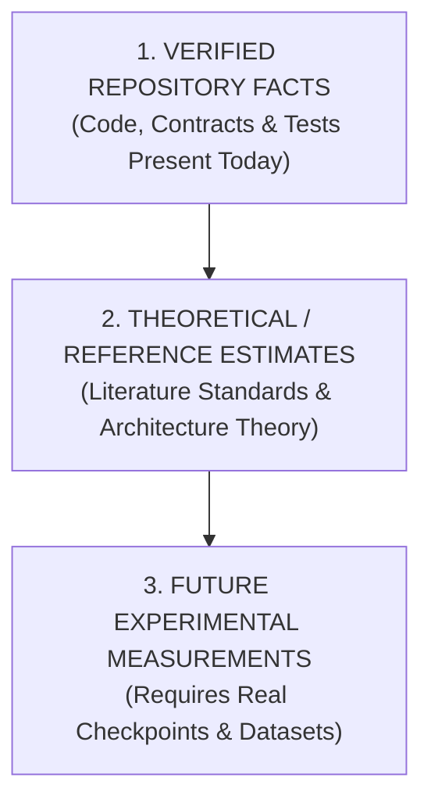

# Workstream B B5.1 — Model Architecture Trade-off Specification

**Date:** 2026-09-24  
**Gate:** B5.1 — Architecture Trade-off Specification (Sub-gate of B5: Model Architecture Evaluation)  
**Author:** Workstream B (AI / Procedure Intelligence)  
**Status:** SPECIFIED — COMPARATIVE FRAMEWORK ESTABLISHED (NO WINNER DECLARED)

---

## 1. Purpose & Scope

The purpose of Gate B5 is to evaluate candidate spatial-temporal modeling architectures for human activity recognition (HAR) and procedure monitoring within the ISRO SIH26174 BAS Experiment Monitor.

This document establishes the **Architecture Trade-off Specification (B5.1)**, providing a formal, rigorous, side-by-side comparative framework for the two primary architectural paradigms:

1. **Candidate Architecture A:** End-to-End Spatio-Temporal Video Model (**R(2+1)D-18** / 3D CNN).
2. **Candidate Architecture B:** Compact Feature-Based Temporal Model (**1D-TCN** / Temporal Convolutional Network operating on 111-dimensional spatial-geometric feature vectors).

> [!IMPORTANT]
> **Task Boundary & Neutrality Rule:**
> - Gate B5.1 defines the **comparison framework, tensor contracts, metrics, and decision rules only**.
> - It does **NOT** declare a winner or select an architecture.
> - It does **NOT** fabricate performance metrics or claim empirical superiority for either candidate.
> - Final architectural selection will occur only when empirical benchmark evidence is collected under Gate B5.2 and downstream real-data evaluation gates.

---

## 2. Candidate Architecture A: End-to-End Spatio-Temporal Video Model (R(2+1)D-18)

### 2.1 Concept & Pipeline
Architecture A processes video as a raw 5-dimensional spatio-temporal tensor directly through factorized 3D convolutions (decomposing 3D convolutions into separate 2D spatial and 1D temporal convolutions).

```
Raw Video Stream / File
         ↓
Frame Sampling & Decoding (OpenCV / PyAV)
         ↓
Temporal Clip Buffer (T frames)
         ↓
Spatio-Temporal Tensor (B, C, T, H, W)
         ↓
R(2+1)D-18 Backbone (ResNet-style Spatio-Temporal Convolutions)
         ↓
Global Spatio-Temporal Average Pooling
         ↓
Linear Classification Head (Softmax / Logits)
         ↓
Action Class Prediction & Confidence Score
```

### 2.2 Input Representation & Tensor Contract
- **Input Modality:** RGB Video Voxels (Pixel intensities normalized to $[0.0, 1.0]$ or standard ImageNet/Kinetics mean and std).
- **Formal Tensor Shape:** `(B, C, T, H, W)`
  - $B$: Batch size ($B = 1$ during live edge inference).
  - $C$: Color channels ($C = 3$ for RGB).
  - $T$: Temporal clip length (Nominal: $T = 16$ or $T = 32$ frames).
  - $H$: Frame height (Nominal: $H = 112$ or $H = 224$ pixels).
  - $W$: Frame width (Nominal: $W = 112$ or $W = 224$ pixels).
- **Sampling Strategy:** Uniform temporal stride (e.g., sample every 2nd or 4th frame from a 30 FPS stream) yielding a temporal receptive field of $1.0\text{--}2.0\text{ s}$.

### 2.3 Model Role & Expected Outputs
- **Role:** Direct end-to-end action classification from appearance and motion cues without explicit dependency on external landmark extractors or object bounding boxes.
- **Output:** Class probability vector across the canonical actions ($K$ classes) and confidence score $\in [0.0, 1.0]$.

### 2.4 Dependency & Runtime Requirements
- **Framework Dependencies:** PyTorch (`torch`, `torchvision`, `pytorchvideo`) or ONNX Runtime / TensorRT.
- **Hardware Acceleration:** Heavily benefits from GPU acceleration or specialized NPU video operators (e.g., Hailo-8L with 3D convolution compiler support).
- **Edge Deployment Challenges:** High memory bandwidth demand; computationally heavy on host CPU (Raspberry Pi 5 ARM Cortex-A76); frame accumulation latency before first inference.

---

## 3. Candidate Architecture B: Compact Feature-Based Temporal Model (1D-TCN)

### 3.1 Concept & Pipeline
Architecture B decouples spatial perception from temporal sequence classification. Upstream specialized detectors (Hailo-8L YOLOv8 object detector + MediaPipe/Hailo 3D pose and hand tracker) extract compact geometric landmarks per frame. The 1D-TCN consumes a sliding window of these 1D spatial feature vectors.

```
Raw Video Stream
    ↓
┌─────────────────────────────────────────────────────────┐
│ Upstream Spatial Perception Layer                       │
│  - Object Detector: 4 primary object centroids (cx, cy) │
│  - 3D Pose Detector: 33 body landmarks (x, y, z)        │
│  - Hand Tracker: 21 hand landmarks / bounding boxes     │
│  - Geometric Interaction Engine: Hand-Object Proximity  │
└────────────────────────────┬────────────────────────────┘
                             ↓
       FrameProcessor.extract_keypoint_vector()
                             ↓
              1D Spatial Vector (D = 111)
                             ↓
               Temporal Buffer (deque, T = 30)
                             ↓
                  Feature Tensor (B, T, D)
                             ↓
         1D-TCN (Dilated Causal 1D Convolutions + Residuals)
                             ↓
                  Temporal Pooling / Head
                             ↓
             Action Class Prediction & Confidence Score
```

### 3.2 Input Representation & Current 111-Feature Vector Definition
- **Input Modality:** Geometric spatial coordinates and detection confidence scores extracted per frame.
- **Current Repository Feature Breakdown ($D = 111$):**
  1. **3D Body Pose Landmarks:** 33 joints $\times 3\ (x, y, z) = 99$ float32 features.
  2. **Primary Object Centroids & Confidence:** Up to 4 detected objects $\times 3\ (c_x, c_y, \text{confidence}) = 12$ float32 features.
  3. **Total Feature Dimensionality:** $D = 99 + 12 = 111$ float32 values per frame.
- **Formal Tensor Shape:** `(B, T, D)`
  - $B$: Batch size ($B = 1$ during live edge inference).
  - $T$: Temporal sliding window length (Implemented in [`backend/ai/action_classifier.py`](file:///E:/Technical_Projects/2026-SIH/SIH26174/backend/ai/action_classifier.py) as $T = 30$ frames $\approx 1.0\text{--}2.0\text{ s}$ at $15\text{--}30\text{ FPS}$).
  - $D$: Feature dimension ($D = 111$).

### 3.3 Model Role & Expected Outputs
- **Role:** Lightweight temporal sequence classifier evaluating the evolution of body posture and object manipulation geometry over time.
- **Output:** Class probability vector across canonical procedure actions and confidence score $\in [0.0, 1.0]$.

### 3.4 Dependency & Runtime Requirements
- **Framework Dependencies:** `tflite_runtime`, ONNX Runtime, pure NumPy, or lightweight C++ inference engine.
- **Hardware Footprint:** Extremely lightweight ($<5\text{ MB}$ RAM, $<3\text{ ms}$ inference time on Raspberry Pi 5 CPU).
- **Edge Deployment Considerations:** Relies entirely on the stability and detection quality of upstream spatial detectors; spatial errors directly propagate to the temporal vector.

---

## 4. Side-by-Side Comparison Table

The following comparison details the structural, computational, operational, and integration trade-offs between both candidate architectures.

| Evaluation Dimension | Candidate Architecture A: R(2+1)D-18 | Candidate Architecture B: 1D-TCN (Decoupled) |
|---|---|---|
| **Input Data Representation** | Raw RGB Video Tensor: `(B, 3, T, H, W)` | Extracted Feature Tensor: `(B, T, 111)` |
| **Temporal Modeling Mechanism** | 1D temporal convolutions interleaved across 2D spatial layers | 1D dilated causal temporal convolutions with residual blocks |
| **Spatial Modeling Mechanism** | 2D spatial convolutions directly on pixel intensities | Upstream YOLO object detector + 3D pose/hand tracker |
| **Estimated Parameter Scale** | $\approx 31.5\text{M -- }33.0\text{M}$ parameters *(THEORETICAL REFERENCE)* | $\approx 20\text{K -- }100\text{K}$ parameters *(THEORETICAL REFERENCE)* |
| **Estimated Compute Scale** | $\approx 7.5\text{ -- }15.0\text{ GFLOPs}$ per clip *(THEORETICAL REFERENCE)* | $\approx 1.0\text{ -- }5.0\text{ MFLOPs}$ per window *(THEORETICAL REFERENCE)* |
| **RAM Footprint (Model + Tensors)** | $\approx 150\text{ MB -- }500\text{ MB}$ runtime memory *(THEORETICAL REFERENCE)* | $< 5\text{ MB}$ runtime memory *(VERIFIED HOST BUFFER < 1 MB)* |
| **Expected Inference Latency (RPi 5 CPU)** | $\approx 150\text{ -- }400\text{ ms}$ per clip *(THEORETICAL ESTIMATE)* | $< 3\text{ ms}$ per window *(THEORETICAL / SPECIFIED IN CODE)* |
| **Expected Inference Throughput (FPS)** | $2.5\text{ -- }6.5\text{ FPS}$ on host CPU *(THEORETICAL ESTIMATE)* | $> 100\text{ FPS}$ for TCN alone *(THEORETICAL ESTIMATE)* |
| **Host CPU Suitability (RPi 5)** | Poor (High CPU utilization, thermal throttling risk) | Excellent (Minimal CPU overhead; fits 15 FPS budget) |
| **Accelerator / NPU Suitability** | High if NPU supports 3D convolutions; otherwise unsupported | High: Offloads YOLO/Pose to Hailo-8L; TCN on CPU |
| **Dataset & Training Volume Need** | High: Requires thousands of diverse video clips to prevent overfitting | Moderate/Low: Geometric coordinates reduce sample complexity |
| **Annotation Requirements** | Video-level action timestamps and clip boundary labels | Spatial annotations (BBoxes + Keypoints) + Action labels |
| **Orientation & Microgravity Robustness** | Sensitive to visual roll/pitch unless augmented extensively | Geometric normalization (distance/scale invariants) is feasible |
| **Pipeline Modularity & Debugging** | Black-box: Difficult to diagnose spatial vs temporal failures | Transparent: Inspect spatial coordinates vs temporal state |
| **Upstream Dependency Coupling** | Zero upstream dependencies (Direct pixel consumer) | High: If pose or object detector fails, feature vector degrades |
| **Implementation Complexity** | Standard video CNN training pipeline | Multi-stage: Detector integration + Vector extraction + TCN |

---

## 5. Epistemic Status: Fact vs. Estimate vs. Future Measurement

To maintain strict scientific integrity and prevent hallucinated benchmark claims, all statements in this specification are categorized into three distinct epistemic tiers:



### 5.1 Verified Repository Facts
- The frozen public AI contract shape in [`docs/architecture.md`](file:///E:/Technical_Projects/2026-SIH/SIH26174/docs/architecture.md) §2 requires exact keys: `timestamp`, `action`, `object`, `confidence`, `expected_step`, `detected_step`, `status`, `next_step`.
- [`backend/video/frame_processor.py`](file:///E:/Technical_Projects/2026-SIH/SIH26174/backend/video/frame_processor.py) extracts an exact **111-dimensional float32 vector** (99 pose + 12 object centroid coordinates).
- [`backend/ai/action_classifier.py`](file:///E:/Technical_Projects/2026-SIH/SIH26174/backend/ai/action_classifier.py) implements a **30-frame temporal sliding window buffer** with fallback heuristics.
- No trained checkpoint (`.pt`, `.pth`, `.tflite`, `.onnx`) exists for either R(2+1)D or 1D-TCN in the repository.
- HMDB51 raw video data exists at `training/data/raw/hmdb51_sta/` (51 generic classes); no EXP-001 procedure dataset has been collected.

### 5.2 Theoretical / Reference Estimates
- R(2+1)D-18 standard parameter count ($\approx 31.5\text{M}$) and FLOP count ($\approx 7.5\text{ GFLOPs}$ for $16 \times 112 \times 112$ inputs) based on Tran et al. (2018).
- 1D-TCN standard parameter count ($\approx 50\text{K}$) and FLOP count ($\approx 2\text{ MFLOPs}$) based on standard causal dilated convolutional architectures for vector sequences.
- Estimated execution latency on Raspberry Pi 5 ARM Cortex-A76 processor cores without hardware acceleration.

### 5.3 Future Experimental Measurements (To be measured in Gate B5.2 / B17)
- Empirical per-frame and per-window latency on target edge hardware.
- Real RAM and memory bandwidth consumption under continuous streaming.
- Action recognition accuracy, Precision, Recall, Macro-F1, and Confusion Matrices on real held-out procedure clips.
- Robustness degradation under the 7 canonical orientation angles ($0^\circ\text{--}270^\circ$).

---

## 6. Formal Benchmark Metrics for Gate B5

When trained models and real evaluation data become available, Gate B5 will execute benchmarks across three distinct metric clusters:

### 6.1 Classification Performance Metrics
1. **Per-Action Precision ($P_k$):** Proportion of predicted occurrences of action $k$ that are correct.
2. **Per-Action Recall ($R_k$):** Proportion of true occurrences of action $k$ that are detected.
3. **Per-Action F1-Score ($F1_k$):** Harmonic mean of precision and recall for action $k$.
4. **Macro-Averaged F1 ($F1_{\text{macro}}$):** Unweighted average of F1-scores across all 5 canonical EXP-001 actions.
5. **Confusion Matrix ($M_{K \times K}$):** Pairwise action transition and substitution error matrix.

### 6.2 Computational & System Resource Metrics
1. **Model Size on Disk (MB):** Uncompressed artifact storage footprint.
2. **Runtime Memory Consumption (RAM in MB):** Peak RSS memory allocated during active 30 FPS inference.
3. **Inference Latency (ms):** Wall-clock execution time per evaluation window (mean, median, 95th percentile).
4. **Effective Throughput (FPS):** Sustainable frames processed per second on host CPU and target edge hardware.
5. **Host CPU Utilization (%):** Average CPU core load during continuous processing.

### 6.3 Operational & Environmental Robustness Metrics
1. **Orientation Drop ($\Delta F1_\theta$):** Performance degradation under the 7 canonical orientation angles relative to normal $0^\circ$:
   $$\Delta F1_\theta = F1_{\theta=0^\circ} - F1_\theta$$
2. **Disturbance Resilience:** Accuracy degradation under scale ($\pm 20\%$), translation ($\pm 10\%$), brightness ($\pm 30$), blur, and occlusion ($15\%$).
3. **Boundary Jitter / Temporal Stability:** Variance in action detection onset/offset timestamps across adjacent frames.

---

## 7. Controlled Benchmark Protocol & Invariants

To guarantee an unbiased and scientifically valid comparison between Architecture A and Architecture B, the following evaluation invariants must be strictly maintained:

1. **Identical Data Split:** Both models must be evaluated on the exact same held-out subject-level test clips.
2. **Identical Action Space:** Both models must evaluate the exact same 5 canonical EXP-001 procedure actions (`PICK_RED`, `PLACE_RED`, `PICK_BLUE`, `PLACE_BLUE`, `CLOSE_LID`).
3. **Identical Temporal Policy:** Both models must evaluate corresponding temporal windows ($1.0\text{--}2.0\text{ s}$ duration) with identical stride.
4. **Identical Hardware Platform:** Latency, RAM, and throughput measurements must be captured on the same target hardware configuration (Raspberry Pi 5 / reference CPU).
5. **Leakage Isolation:** No synthetic perturbation or evaluation clip may be shared with training partitions.

---

## 8. Current Blockers for Real Model Evaluation

The following dependencies are currently absent from the repository and explicitly prevent empirical model execution:

```
┌─────────────────────────────────────────────────────────────────────────┐
│                           B5 BLOCKER REGISTER                           │
├───────────────────────────────────┬─────────────────────────────────────┤
│ Dependency Item                   │ Current Status                      │
├───────────────────────────────────┼─────────────────────────────────────┤
│ EXP-001 Procedure Dataset         │ NOT COLLECTED (Gate B3 Protocol)    │
│ Part-1 5-Action Model Weights     │ NOT TRAINED / NOT EXPORTED          │
│ Candidate A (R(2+1)D) Checkpoint  │ NOT PRESENT IN REPOSITORY           │
│ Candidate B (1D-TCN) Checkpoint   │ NOT PRESENT IN REPOSITORY           │
│ PyTorch / Torchvision Environment │ NOT INSTALLED IN ACTIVE RUNTIME     │
└───────────────────────────────────┴─────────────────────────────────────┘
```

**Operational Mandate:** Because these artifacts do not exist, Gate B5.1 documents the architectural comparison specifications and theoretical trade-offs without executing unvalidated model inference.

---

## 9. Model Input Contracts & Frozen Public AI Schema

### 9.1 Internal Model Input Tensors
- **Candidate A (R(2+1)D-18):**
  $$\mathbf{X}_A \in \mathbb{R}^{B \times C \times T \times H \times W} \quad (B=1,\ C=3,\ T=16\text{ or }32,\ H=112\text{ or }224,\ W=112\text{ or }224)$$
- **Candidate B (1D-TCN):**
  $$\mathbf{X}_B \in \mathbb{R}^{B \times T \times D} \quad (B=1,\ T=30,\ D=111)$$

### 9.2 Frozen Public Output Contract ([`docs/architecture.md`](file:///E:/Technical_Projects/2026-SIH/SIH26174/docs/architecture.md) §2)
Regardless of whether Candidate A or Candidate B is evaluated or integrated, the output payload emitted by [`backend/ai/inference_pipeline.py`](file:///E:/Technical_Projects/2026-SIH/SIH26174/backend/ai/inference_pipeline.py) must strictly adhere to the frozen contract:

```json
{
  "timestamp": "2026-08-29T10:00:05",
  "action": "PICK_RED",
  "object": "RED_SAMPLE",
  "confidence": 0.94,
  "expected_step": "S1",
  "detected_step": "S1",
  "status": "VALID",
  "next_step": "S2"
}
```

*Valid `status` enum values:* `VALID`, `SKIPPED`, `OUT_OF_SEQUENCE`.

---

## 10. Decision Rule for Gate B5

The final architectural selection between Candidate A (R(2+1)D) and Candidate B (1D-TCN) will **NOT** be determined by raw classification accuracy alone. 

The selection decision must be governed by a **multi-criteria objective function** reflecting edge operational realities aboard the Bharatiya Antariksh Station:

$$\text{Decision Score} = w_1 \cdot F1_{\text{macro}} + w_2 \cdot \text{EdgeFeasibility} + w_3 \cdot \text{RobustnessScore} - w_4 \cdot \text{LatencyOverhead}$$

### Mandatory Gating Criteria:
1. **Edge Real-Time Constraint:** Total end-to-end perception pipeline latency must satisfy the real-time target ($\le 66.6\text{ ms}$ per frame for $15\text{ FPS}$ operation on Raspberry Pi 5).
2. **Resource Boundary:** Total peak RAM must not exceed available host memory budget ($< 1.0\text{ GB}$ dedicated to AI pipeline).
3. **Microgravity Robustness:** The selected architecture must demonstrate bounded degradation ($\le 15\%$ maximum F1 drop) across canonical orientation angles.
4. **Auditability & Explainability:** The architecture must allow deterministic verification and failure debugging in spaceflight operations.

---

## 11. Conclusion & Handoff to Gate B5.2

Gate B5.1 successfully establishes the formal trade-off specification for Candidate Architecture A (R(2+1)D-18) and Candidate Architecture B (1D-TCN).

- **Candidate A** offers unified end-to-end spatio-temporal modeling directly from pixels at the cost of substantial computational and memory demands.
- **Candidate B** offers extreme edge computational efficiency ($<3\text{ ms}$, $<5\text{ MB}$ RAM) and modular explainability at the cost of structural dependency on upstream spatial detectors.

**Handoff:** Sub-gate **B5.2** will implement the deterministic architecture benchmark harness and parameter complexity profiling framework without fabricating classification results.
