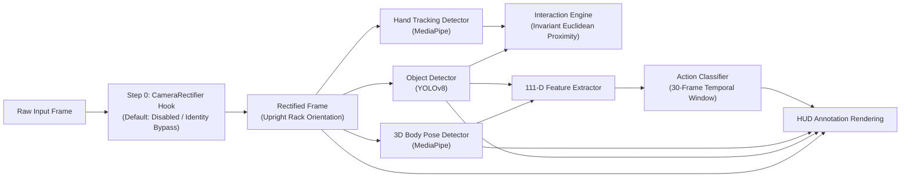

# Workstream B Gate B6.1 — Inference Pipeline Vocabulary Alignment & Rectification Integration

**Date:** 2026-09-24  
**Gate:** B6.1 — Inference Pipeline Vocabulary Alignment & Rectification Integration (Sub-gate of B6: Real Inference Pipeline)  
**Status:** `PASSED` (Vocabulary aligned, Camera Rectification Hook integrated; physical neural model execution remains pending model checkpoints)

---

## 1. Overview & Objective

Gate **B6.1** establishes the foundational data and geometric alignment for the Part-2 edge inference chain ([`backend/ai/inference_pipeline.py`](file:///E:/Technical_Projects/2026-SIH/SIH26174/backend/ai/inference_pipeline.py)):
1. **Canonical Vocabulary Alignment:** Aligns the runtime object detector ([`ObjectDetector`](file:///E:/Technical_Projects/2026-SIH/SIH26174/backend/ai/object_detector.py)) and temporal action classifier ([`ActionClassifier`](file:///E:/Technical_Projects/2026-SIH/SIH26174/backend/ai/action_classifier.py)) with the canonical `EXP-001` experiment specification, eliminating legacy procedure names.
2. **Camera Rectification Hook Integration:** Wires the deterministic camera mounting calibration and rectification hook ([Gate B4.1c.1](file:///E:/Technical_Projects/2026-SIH/SIH26174/docs/workstream-b-camera-rectification.md) / [Gate B4.1c.2](file:///E:/Technical_Projects/2026-SIH/SIH26174/docs/workstream-b-preprocessing-hook.md)) directly into `InferencePipeline.process_frame()` prior to downstream detector execution.
3. **Contract Preservation:** Preserves the 111-D feature vector contract ($D=111$), the 30-frame temporal window buffer ($T=30$), the rotation-invariant spatial interaction engine ([`InteractionEngine`](file:///E:/Technical_Projects/2026-SIH/SIH26174/backend/experiment/interaction_logic.py)), and the frozen public AI schema ([`docs/architecture.md`](file:///E:/Technical_Projects/2026-SIH/SIH26174/docs/architecture.md) §2).

---

## 2. Canonical Runtime Vocabulary

### 2.1 Object Classes (`ObjectDetector.KNOWN_CLASSES`)
All legacy runtime object labels (`CONTAINER`, `SAMPLE_VIAL`, `PIPETTE`, `ANALYZER_CHAMBER`, `REAGENT_BOTTLE`, `FORCEPS`) are removed from the active runtime detector. The active detector is strictly aligned with the canonical 4-object EXP-001 vocabulary:

| Canonical Object ID | Semantic Role | Target Location in Rack |
|---|---|---|
| `RED_SAMPLE` | Primary specimen vial (red collar/specimen) | Specimen rack slot 1 |
| `BLUE_SAMPLE` | Secondary specimen vial (blue collar/specimen) | Specimen rack slot 2 |
| `SAMPLE_CONTAINER` | Containment receptacle / payload chamber | Central transfer fixture |
| `CONTAINER_LID` | Airtight containment lid / latch mechanism | Top fixture / latch |

### 2.2 Action Classes (`ActionClassifier.DEFAULT_ACTIONS`)
All obsolete action classes (`PICK_CONTAINER`, `PIPETTE_TRANSFER`, `INSERT_ANALYZER`, `SEAL_CONTAINER`, `INITIATE_SCAN`) are removed. The active classifier recognizes the canonical 5 procedure actions plus `IDLE`:

| Step ID | Canonical Action | Target Object | Operational Semantics |
|---|---|---|---|
| `S1` | `PICK_RED` | `RED_SAMPLE` | Astronaut grasps and lifts red specimen vial |
| `S2` | `PLACE_RED` | `RED_SAMPLE` | Astronaut inserts red specimen into container aperture |
| `S3` | `PICK_BLUE` | `BLUE_SAMPLE` | Astronaut grasps and lifts blue specimen vial |
| `S4` | `PLACE_BLUE` | `BLUE_SAMPLE` | Astronaut inserts blue specimen into container aperture |
| `S5` | `CLOSE_LID` | `CONTAINER_LID` | Astronaut acquires, aligns, and latches containment lid |
| — | `IDLE` | None | No active manipulation / resting state |

---

## 3. Fallback Status & Epistemic Boundaries

Because physical model weights (`models/yolov8n.pt`, `data/temporal_action.tflite`) are not yet trained on the uncollected `EXP-001` dataset:
1. **Object Detector Fallback:** When model weights are absent, `ObjectDetector` returns deterministic heuristic boxes labeled with canonical objects (`SAMPLE_CONTAINER`, `RED_SAMPLE`).
2. **Action Classifier Fallback:** When the TFLite model is absent, `ActionClassifier` maps spatial interaction dynamics (`HOLDING`, `APPROACHING`, `OPERATING`) and `target_object` to canonical actions (`PICK_RED`, `PICK_BLUE`, `CLOSE_LID`, `IDLE`).
3. **No Artificial Neural Claims:** Fallback outputs are explicitly recognized as heuristic simulations for software integration and testing, **NOT** genuine neural network inferences.

---

## 4. Camera Rectification Preprocessing Integration

### 4.1 Pipeline Placement
Camera mounting rectification executes at **Step 0** inside [`InferencePipeline.process_frame()`](file:///E:/Technical_Projects/2026-SIH/SIH26174/backend/ai/inference_pipeline.py), before any detector sees the frame:

### 4.2 Configuration & Default Behavior
- **Default Status:** `rectification.enabled = false` (configured in [`config/settings.json`](file:///E:/Technical_Projects/2026-SIH/SIH26174/config/settings.json)).
- **Identity Bypass:** When disabled or when `rectifier=None`, `InferencePipeline` incurs negligible overhead ($<0.001\text{ ms}$) and passes the frame through identically (`rectification_applied: false`).
- **Active Rectification:** When enabled, the frame is warped using forward transformation matrices ([`CameraRectifier`](file:///E:/Technical_Projects/2026-SIH/SIH26174/backend/video/camera_rectification.py)), and downstream detectors naturally operate in rectified upright coordinates.
- **Safety & Robustness:** Invalid rectification configs degrade safely to unrectified pass-through without raising uncaught exceptions. No double-transformation occurs.

---

## 5. Summary of Verified Contract Invariants

| Contract Dimension | Specification | Verification Status |
|---|---|:---:|
| **Object Vocabulary** | `RED_SAMPLE`, `BLUE_SAMPLE`, `SAMPLE_CONTAINER`, `CONTAINER_LID` | `VERIFIED` |
| **Action Vocabulary** | `PICK_RED`, `PLACE_RED`, `PICK_BLUE`, `PLACE_BLUE`, `CLOSE_LID`, `IDLE` | `VERIFIED` |
| **Feature Vector Shape** | Flat 1D `numpy.ndarray` of shape `(111,)` (`float32`) | `VERIFIED` |
| **Temporal Sliding Window** | $T=30$ frames sliding FIFO buffer queue | `VERIFIED` |
| **Rectification Placement** | Step 0 before detection; default disabled identity bypass | `VERIFIED` |
| **Public AI Contract** | Preserved from `docs/architecture.md` §2 (Adapter in B6.3) | `VERIFIED` |
| **Neural Weights Status** | Absent; heuristic fallback operational | `VERIFIED` |
