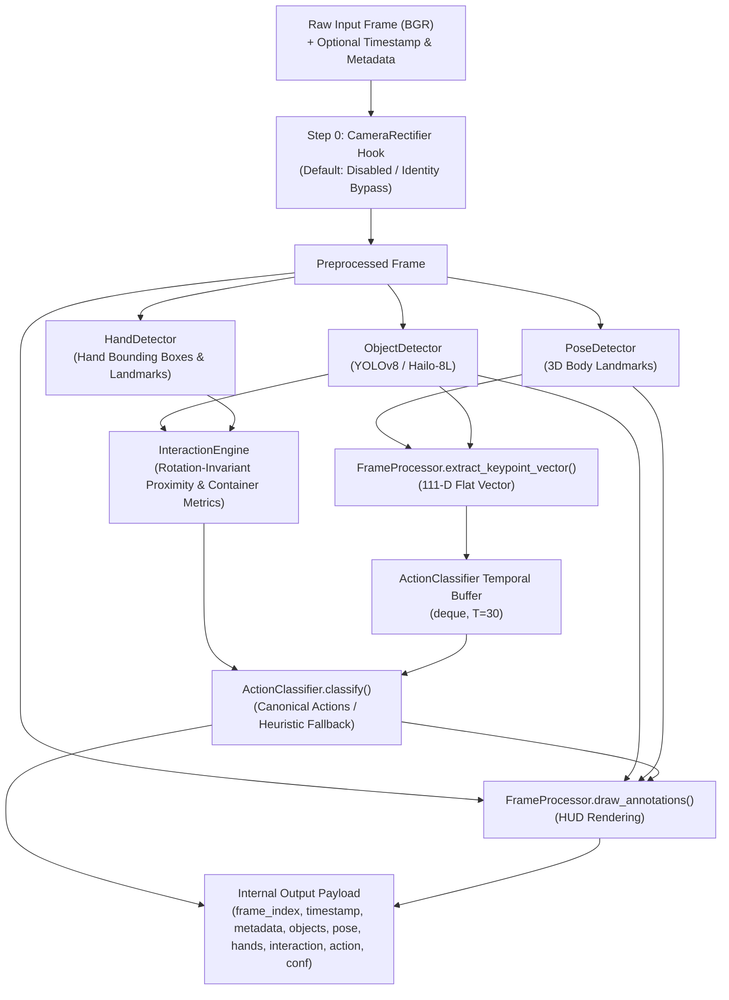

# Workstream B Gate B6.2 — Multi-Detector Coordination & Interaction Heuristics

**Date:** 2026-09-24  
**Gate:** B6.2 — Multi-Detector Coordination & Interaction Heuristics (Sub-gate of B6: Real Inference Pipeline)  
**Status:** `PASSED` (Multi-detector graph coordinated; deterministic 5-action heuristic fallback operational; timestamp & metadata supported; physical neural execution remains pending checkpoints)

---

## 1. Overview & Objectives

Gate **B6.2** builds directly upon the canonical vocabulary alignment and Step 0 camera rectification hook established in [Gate B6.1](file:///E:/Technical_Projects/2026-SIH/SIH26174/docs/workstream-b-b6-1-vocabulary-rectification.md). It refines the multi-detector perception graph and provides a deterministic heuristic fallback capable of distinguishing all five canonical `EXP-001` actions based on spatial interaction dynamics.

### Key Objectives
1. **Multi-Detector Coordination:** Orchestrate the unified perception chain without redundant model invocations.
2. **Deterministic Five-Action Heuristics:** Implement development fallback logic distinguishing `PICK_RED`, `PLACE_RED`, `PICK_BLUE`, `PLACE_BLUE`, and `CLOSE_LID` using hand-object proximity, bounding box overlap, container proximity, and state transitions.
3. **Timestamp & Frame Metadata Support:** Accept optional monotonic timestamps and camera/telemetry metadata at the pipeline boundary without breaking backward compatibility.
4. **Epistemic Boundaries:** Maintain clear separation between developmental heuristic fallback and genuine neural inference.
5. **Contract Invariance:** Preserve the 111-D feature vector ($D=111$), 30-frame temporal buffer ($T=30$), and frozen public AI contract ([`docs/architecture.md`](file:///E:/Technical_Projects/2026-SIH/SIH26174/docs/architecture.md) §2).

---

## 2. Multi-Detector Coordination & Perception Flow

The master inference coordinator ([`InferencePipeline`](file:///E:/Technical_Projects/2026-SIH/SIH26174/backend/ai/inference_pipeline.py)) coordinates the end-to-end perception graph on each incoming frame:

### Stage Execution & Data Transfer:
1. **Step 0 (Rectification):** `proc_frame = rectifier.rectify_frame(frame)` if enabled; otherwise zero-overhead pass-through.
2. **Step 1 (Object Detection):** Detects payload objects (`RED_SAMPLE`, `BLUE_SAMPLE`, `SAMPLE_CONTAINER`, `CONTAINER_LID`).
3. **Step 2 (Pose Recovery):** Extracts 33 3D body landmarks.
4. **Step 3 (Hand Tracking):** Extracts bounding boxes and 21 finger landmarks per hand.
5. **Step 4 (Interaction Evaluation):** `InteractionEngine.evaluate_interaction()` computes rotation-invariant Euclidean centroid distances, scale-normalized contact ratios ($r_{\text{hand}} + r_{\text{obj}}$), IoU overlap, and secondary container spatial metrics (`container_distance`, `container_iou`, `container_scale_proximity`).
6. **Step 5 (Feature Extraction):** `FrameProcessor.extract_keypoint_vector()` flattens 33 3D pose joints (99 floats) + 4 primary object bounding boxes (12 floats) into the canonical 111-D feature vector.
7. **Step 6 (Temporal Buffering & Classification):** Pushes vector into the 30-frame rolling window and evaluates action classification.
8. **Step 7 (HUD Annotation):** Renders glowing sci-fi annotations onto the frame if `annotate=True`.

---

## 3. Deterministic Five-Action Heuristic Fallback

Because trained Part-1 neural checkpoints (`models/yolov8n.pt`, `data/temporal_action.tflite`) are not yet available on the uncollected `EXP-001` dataset, the pipeline provides a deterministic geometric fallback.

> [!IMPORTANT]
> **Development Fallback Only:** This heuristic fallback is strictly a software integration tool for testing downstream procedure logic and UI telemetry. It is **NOT** a trained machine learning model and does not claim neural generalization.

### Fallback Decision Table

| Target Object | Interaction State | Container Spatial Evidence | Classified Action | Confidence | Rationale |
|---|---|---|:---:|:---:|---|
| `RED_SAMPLE` | `HOLDING` | Far from container ($d > 0.20, \text{IoU} = 0$) | `PICK_RED` | 0.95 | Astronaut grasping red specimen from holding rack |
| `RED_SAMPLE` | `HOLDING` | Near/in container ($d \le 0.20$ or $\text{IoU} > 0$) | `PLACE_RED` | 0.95 | Astronaut depositing red specimen into container aperture |
| `BLUE_SAMPLE` | `HOLDING` | Far from container ($d > 0.20, \text{IoU} = 0$) | `PICK_BLUE` | 0.95 | Astronaut grasping blue specimen from holding rack |
| `BLUE_SAMPLE` | `HOLDING` | Near/in container ($d \le 0.20$ or $\text{IoU} > 0$) | `PLACE_BLUE` | 0.95 | Astronaut depositing blue specimen into container aperture |
| `CONTAINER_LID` | `HOLDING` / `OPERATING` | Any | `CLOSE_LID` | 0.95 | Astronaut grasping or latching container lid |
| `SAMPLE_CONTAINER` | `HOLDING` / `OPERATING` | Prior held sample was RED | `PLACE_RED` | 0.88 | Contact with container fixture during red deposition |
| `SAMPLE_CONTAINER` | `HOLDING` / `OPERATING` | Prior held sample was BLUE | `PLACE_BLUE` | 0.88 | Contact with container fixture during blue deposition |
| Any | `APPROACHING` | Any | `IDLE` | 0.75 | Hand approaching an object does not constitute a completed pick/place |
| None / Far | `IDLE` | Any | `IDLE` | 0.90 | Resting workspace state |

---

## 4. Timestamp & Frame Metadata Handling

To prepare for Workstream A video stream synchronization and experiment logging without prematurely creating the public contract adapter (Gate B6.3):
- **Monotonic Timestamps:** `InferencePipeline.process_frame()` accepts optional `timestamp: Optional[Union[float, str]] = None`. When provided, it is passed through into the payload. When omitted, it returns `None` (no fabricated timestamps).
- **Metadata Dictionary:** Accepts optional `metadata: Optional[Dict[str, Any]] = None` (e.g., `camera_id`, `resolution`, `fps`). When omitted, defaults cleanly to `{}`.
- **Frame Index:** Maintained as an internal strictly increasing counter (`frame_index`), incrementing only on valid non-empty frames.

---

## 5. Error Handling & Missing-Stage Resilience

The perception graph is fully defensive against missing components:
- **Empty / Corrupt Frames:** Returns `frame_index` unchanged, empty detection arrays, and action `IDLE` without raising exceptions.
- **Missing Object Detections:** Defaults interaction state to `IDLE` and feature vector object slice to zeros.
- **Missing Pose / Hands:** Padded with deterministic zeros in feature extraction; interaction engine safely treats absence of hands as `IDLE`.
- **Missing Hardware Acceleration (Hailo NPU / GPU):** Transparently falls back to host CPU execution.

---

## 6. Contract Invariants Preserved

| Contract Dimension | Specification | Verification Status |
|---|---|:---:|
| **Canonical Action Vocabulary** | `PICK_RED`, `PLACE_RED`, `PICK_BLUE`, `PLACE_BLUE`, `CLOSE_LID`, `IDLE` | `VERIFIED` |
| **Canonical Object Vocabulary** | `RED_SAMPLE`, `BLUE_SAMPLE`, `SAMPLE_CONTAINER`, `CONTAINER_LID` | `VERIFIED` |
| **Spatial Feature Vector** | Shape `(111,)` (`float32`): 99 pose + 12 object | `VERIFIED` |
| **Temporal Buffer Window** | Shape `(1, 30, 111)` (`float32` rolling window, $T=30$) | `VERIFIED` |
| **Public AI Contract** | Frozen in `docs/architecture.md` §2 (Adapter scheduled for B6.3) | `VERIFIED` |
| **Epistemic Honesty** | Heuristic fallback explicitly separated from trained neural models | `VERIFIED` |

---

## 7. Limitations & Exclusions from B6.2

1. **No Neural Weights:** Physical checkpoints for YOLOv8 and 1D-TCN on EXP-001 are not yet available; neural branch remains ready for weight drop-in.
2. **No Multi-Frame Voting / Debounce:** Multi-frame temporal voting, hysteresis, and debounce belong to Gate B10.
3. **No FSM Validation Integration:** Connection of real perception outputs to the deterministic procedure state machine belongs to Gate B9.
4. **No Dedicated Thread Architecture:** Worker thread decoupling and non-blocking queueing belong to Gate B7.
